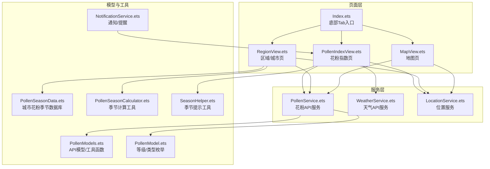
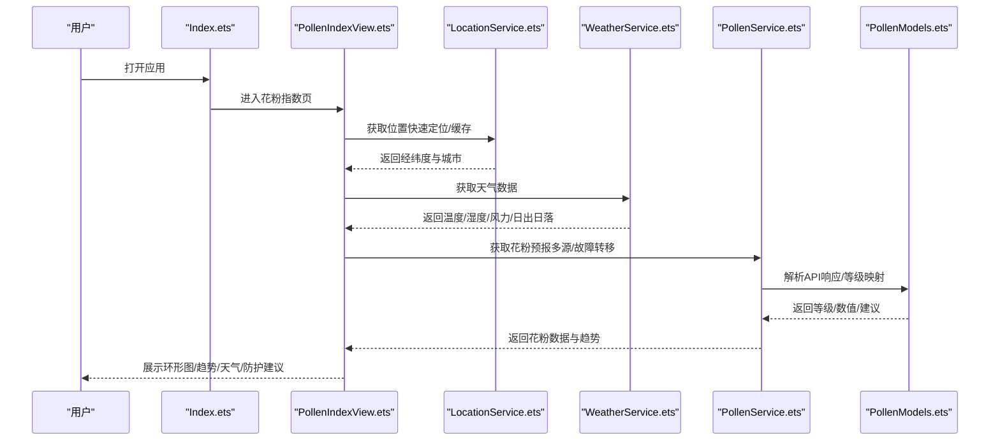
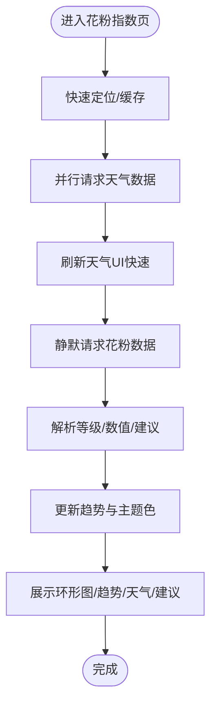
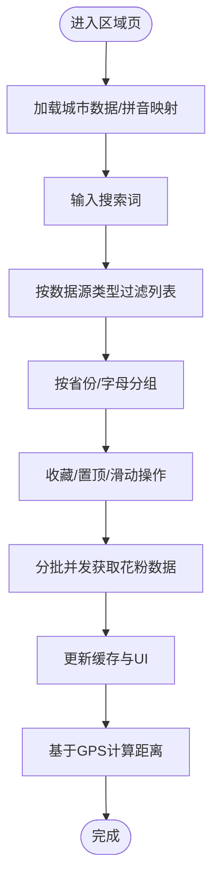
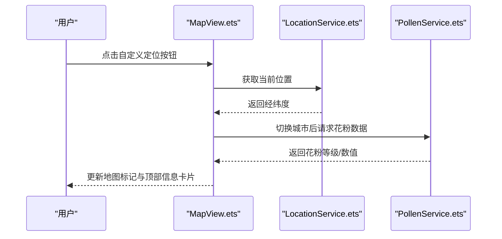
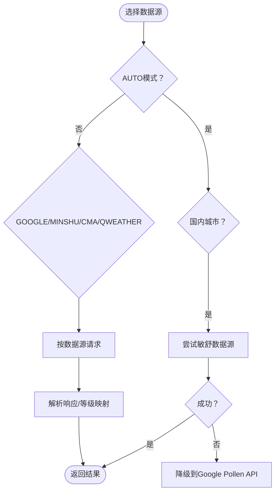
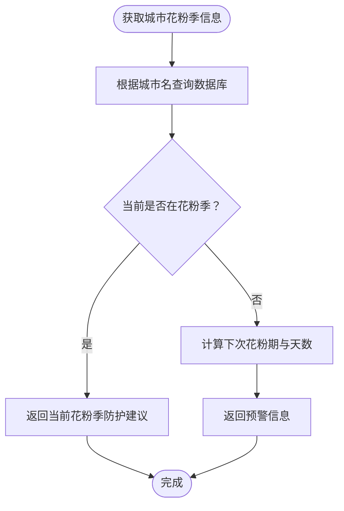
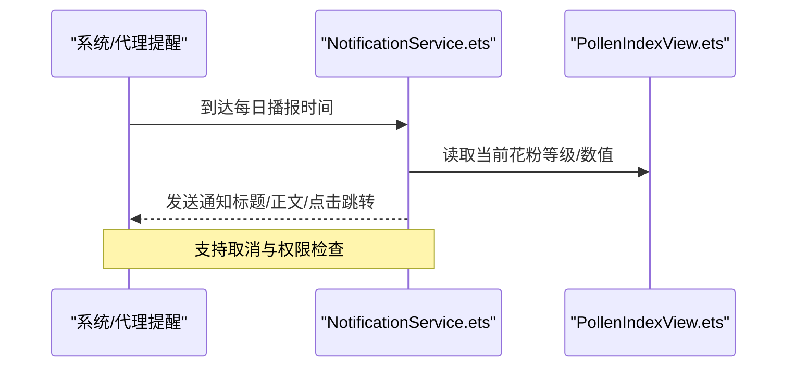
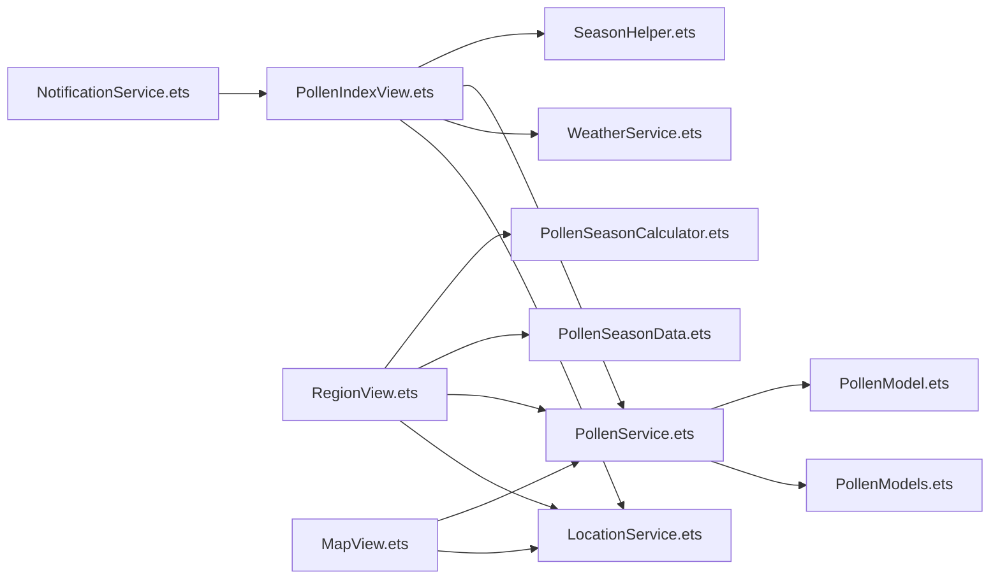

# 应用介绍与功能特性

<cite>
**本文引用的文件**
- [PollenModel.ets](file://entry/src/main/ets/model/PollenModel.ets)
- [PollenModels.ets](file://entry/src/main/ets/model/PollenModels.ets)
- [PollenService.ets](file://entry/src/main/ets/service/PollenService.ets)
- [WeatherService.ets](file://entry/src/main/ets/service/WeatherService.ets)
- [LocationService.ets](file://entry/src/main/ets/service/LocationService.ets)
- [PollenIndexView.ets](file://entry/src/main/ets/views/PollenIndexView.ets)
- [RegionView.ets](file://entry/src/main/ets/views/RegionView.ets)
- [MapView.ets](file://entry/src/main/ets/views/MapView.ets)
- [Index.ets](file://entry/src/main/ets/pages/Index.ets)
- [PollenSeasonData.ets](file://entry/src/main/ets/model/PollenSeasonData.ets)
- [PollenSeasonCalculator.ets](file://entry/src/main/ets/utils/PollenSeasonCalculator.ets)
- [NotificationService.ets](file://entry/src/main/ets/utils/NotificationService.ets)
- [SeasonHelper.ets](file://entry/src/main/ets/utils/SeasonHelper.ets)
- [string.json](file://entry/src/main/resources/base/element/string.json)
- [module.json5](file://entry/src/main/module.json5)
</cite>

## 目录
1. [引言](#引言)
2. [项目结构](#项目结构)
3. [核心组件](#核心组件)
4. [架构总览](#架构总览)
5. [详细组件分析](#详细组件分析)
6. [依赖分析](#依赖分析)
7. [性能考虑](#性能考虑)
8. [故障排查指南](#故障排查指南)
9. [结论](#结论)
10. [附录](#附录)

## 引言
PollenForecast 是一款面向花粉过敏人群与关注空气质量用户的智能预报应用。其核心使命是通过科学的数据分析与多源数据融合，提供准确、及时、可执行的花粉浓度预报与健康提醒，帮助用户在花粉高发期做出合理的户外安排与防护决策。应用的价值主张在于：
- 实时与短期预报：提供未来数天的花粉浓度预测，辅助用户规划出行与运动。
- 天气与环境联动：结合温度、湿度、风力、日出日落等天气要素，解释花粉扩散与聚集的环境条件。
- 多数据源支持：支持 Google Pollen、敏舒、和风天气等多种数据源，自动故障转移与降级，提升稳定性与覆盖率。
- 个性化防护建议：基于城市花粉季节数据库与用户当前数据，提供可操作的健康提示与防护动作。
- 地图与位置服务：内置地图视图与位置服务，支持一键定位、城市切换与热点城市标记。

花粉浓度对健康的影响显著，尤其对过敏性鼻炎、哮喘等呼吸道疾病患者。长期暴露在高浓度花粉环境中，可能导致打喷嚏、流鼻涕、鼻塞、眼痒、皮疹甚至呼吸困难。PollenForecast 通过“数据驱动”的方式，帮助用户降低暴露风险，提升生活质量。

## 项目结构
应用采用模块化组织，核心页面由底部 Tab 导航承载，包含“花粉指数”“区域”“地图”“设置”四个主页面；数据层通过服务与模型解耦，视图层负责展示与交互，工具与辅助模块提供季节、通知、定位等功能支撑。

图表来源
- [Index.ets](file://entry/src/main/ets/pages/Index.ets#L1-L97)
- [PollenIndexView.ets](file://entry/src/main/ets/views/PollenIndexView.ets#L1-L120)
- [RegionView.ets](file://entry/src/main/ets/views/RegionView.ets#L1-L120)
- [MapView.ets](file://entry/src/main/ets/views/MapView.ets#L1-L120)
- [PollenService.ets](file://entry/src/main/ets/service/PollenService.ets#L1-L120)
- [WeatherService.ets](file://entry/src/main/ets/service/WeatherService.ets#L1-L120)
- [LocationService.ets](file://entry/src/main/ets/service/LocationService.ets#L1-L120)
- [PollenModels.ets](file://entry/src/main/ets/model/PollenModels.ets#L1-L120)
- [PollenModel.ets](file://entry/src/main/ets/model/PollenModel.ets#L1-L120)
- [PollenSeasonData.ets](file://entry/src/main/ets/model/PollenSeasonData.ets#L1-L120)
- [PollenSeasonCalculator.ets](file://entry/src/main/ets/utils/PollenSeasonCalculator.ets#L1-L120)
- [SeasonHelper.ets](file://entry/src/main/ets/utils/SeasonHelper.ets#L1-L120)
- [NotificationService.ets](file://entry/src/main/ets/utils/NotificationService.ets#L1-L120)

章节来源
- [Index.ets](file://entry/src/main/ets/pages/Index.ets#L1-L97)
- [module.json5](file://entry/src/main/module.json5#L1-L122)

## 核心组件
- 花粉数据模型与工具
  - 等级与类型枚举、位置信息、预报结构、等级到颜色/文本的映射等，统一规范数据表达与展示。
  - 参考路径：[PollenModel.ets](file://entry/src/main/ets/model/PollenModel.ets#L1-L160)、[PollenModels.ets](file://entry/src/main/ets/model/PollenModels.ets#L1-L256)

- 花粉 API 服务
  - 多服务器故障转移、自动/手动数据源选择（Google/CMA/QWeather/敏舒）、请求超时与健康检查、降级策略。
  - 参考路径：[PollenService.ets](file://entry/src/main/ets/service/PollenService.ets#L1-L438)

- 天气 API 服务
  - 通过代理服务聚合和风天气数据，提供温度、体感、风速、湿度、气压、日出日落及短期预报。
  - 参考路径：[WeatherService.ets](file://entry/src/main/ets/service/WeatherService.ets#L1-L232)

- 位置服务
  - 快速定位（缓存/最后位置/GPS）、权限申请、位置监听、逆地理编码、默认位置回退。
  - 参考路径：[LocationService.ets](file://entry/src/main/ets/service/LocationService.ets#L1-L551)

- 页面视图
  - 花粉指数页：环形图、趋势图、天气卡片、防护指南、下拉刷新与无障碍标签。
  - 区域页：城市列表、搜索/分组/收藏/置顶、批量花粉数据缓存、距离计算。
  - 地图页：华为 Map Kit 集成、标记管理、相机控制、夜间模式、智感握姿与震动反馈。
  - 参考路径：[PollenIndexView.ets](file://entry/src/main/ets/views/PollenIndexView.ets#L1-L420)、[RegionView.ets](file://entry/src/main/ets/views/RegionView.ets#L1-L220)、[MapView.ets](file://entry/src/main/ets/views/MapView.ets#L1-L220)

- 季节与提醒
  - 城市花粉季节数据库、季节计算工具、季节提示工具、通知与每日定时提醒。
  - 参考路径：[PollenSeasonData.ets](file://entry/src/main/ets/model/PollenSeasonData.ets#L1-L439)、[PollenSeasonCalculator.ets](file://entry/src/main/ets/utils/PollenSeasonCalculator.ets#L1-L209)、[SeasonHelper.ets](file://entry/src/main/ets/utils/SeasonHelper.ets#L1-L154)、[NotificationService.ets](file://entry/src/main/ets/utils/NotificationService.ets#L1-L355)

章节来源
- [PollenModel.ets](file://entry/src/main/ets/model/PollenModel.ets#L1-L160)
- [PollenModels.ets](file://entry/src/main/ets/model/PollenModels.ets#L1-L256)
- [PollenService.ets](file://entry/src/main/ets/service/PollenService.ets#L1-L438)
- [WeatherService.ets](file://entry/src/main/ets/service/WeatherService.ets#L1-L232)
- [LocationService.ets](file://entry/src/main/ets/service/LocationService.ets#L1-L551)
- [PollenIndexView.ets](file://entry/src/main/ets/views/PollenIndexView.ets#L1-L420)
- [RegionView.ets](file://entry/src/main/ets/views/RegionView.ets#L1-L220)
- [MapView.ets](file://entry/src/main/ets/views/MapView.ets#L1-L220)
- [PollenSeasonData.ets](file://entry/src/main/ets/model/PollenSeasonData.ets#L1-L439)
- [PollenSeasonCalculator.ets](file://entry/src/main/ets/utils/PollenSeasonCalculator.ets#L1-L209)
- [SeasonHelper.ets](file://entry/src/main/ets/utils/SeasonHelper.ets#L1-L154)
- [NotificationService.ets](file://entry/src/main/ets/utils/NotificationService.ets#L1-L355)

## 架构总览
应用采用“页面-服务-模型-工具”的分层架构，页面负责交互与展示，服务负责网络与业务编排，模型提供数据结构与转换，工具提供算法与辅助能力。整体流程如下：

图表来源
- [Index.ets](file://entry/src/main/ets/pages/Index.ets#L1-L97)
- [PollenIndexView.ets](file://entry/src/main/ets/views/PollenIndexView.ets#L1-L220)
- [LocationService.ets](file://entry/src/main/ets/service/LocationService.ets#L1-L220)
- [WeatherService.ets](file://entry/src/main/ets/service/WeatherService.ets#L1-L180)
- [PollenService.ets](file://entry/src/main/ets/service/PollenService.ets#L1-L220)
- [PollenModels.ets](file://entry/src/main/ets/model/PollenModels.ets#L1-L180)

## 详细组件分析

### 花粉指数页面（Tab1）
- 功能要点
  - 快速定位与缓存：启动即用缓存位置，后台静默更新，提升首帧体验。
  - 天气联动：并行获取天气数据，先刷新 UI，再静默更新花粉，保证流畅度。
  - 花粉展示：环形图显示等级与数值，趋势图展示未来 5 天，支持长按预览。
  - 防护建议：根据数据源与季节提示，提供健康建议与主题色适配。
- 关键流程

图表来源
- [PollenIndexView.ets](file://entry/src/main/ets/views/PollenIndexView.ets#L1-L360)
- [WeatherService.ets](file://entry/src/main/ets/service/WeatherService.ets#L1-L180)
- [PollenService.ets](file://entry/src/main/ets/service/PollenService.ets#L1-L220)
- [PollenModels.ets](file://entry/src/main/ets/model/PollenModels.ets#L1-L180)

章节来源
- [PollenIndexView.ets](file://entry/src/main/ets/views/PollenIndexView.ets#L1-L420)
- [WeatherService.ets](file://entry/src/main/ets/service/WeatherService.ets#L1-L232)
- [PollenService.ets](file://entry/src/main/ets/service/PollenService.ets#L1-L220)
- [PollenModels.ets](file://entry/src/main/ets/model/PollenModels.ets#L1-L180)

### 区域页面（Tab2）与城市搜索
- 功能要点
  - 城市列表：支持按省份/字母分组、搜索、收藏、置顶；支持全国 3200+ 区域（含区县）。
  - 批量获取花粉：分批并发请求，避免阻塞 UI；缓存等级与指数，提升交互响应。
  - 距离计算：基于 GPS 位置计算与各城市的直线距离，动态更新。
  - 数据源感知：根据数据源类型调整搜索范围与展示数量。
- 关键流程

图表来源
- [RegionView.ets](file://entry/src/main/ets/views/RegionView.ets#L1-L220)
- [LocationService.ets](file://entry/src/main/ets/service/LocationService.ets#L1-L220)
- [PollenService.ets](file://entry/src/main/ets/service/PollenService.ets#L1-L220)

章节来源
- [RegionView.ets](file://entry/src/main/ets/views/RegionView.ets#L1-L462)
- [LocationService.ets](file://entry/src/main/ets/service/LocationService.ets#L1-L220)
- [PollenService.ets](file://entry/src/main/ets/service/PollenService.ets#L1-L220)

### 地图页面（Tab3）与位置服务
- 功能要点
  - 华为 Map Kit 集成：自定义定位按钮、相机控制、标记管理、夜间模式适配。
  - 智感握姿：API 20+ 支持，检测握持手型，自动调整按钮位置并震动反馈。
  - 热门城市标记：点击切换城市，更新全局坐标与地图视角。
  - 位置同步：页面可见时从 AppStorage 同步经纬度，避免跨 Tab 数据不同步。
- 关键流程

图表来源
- [MapView.ets](file://entry/src/main/ets/views/MapView.ets#L1-L220)
- [LocationService.ets](file://entry/src/main/ets/service/LocationService.ets#L1-L220)
- [PollenService.ets](file://entry/src/main/ets/service/PollenService.ets#L1-L220)

章节来源
- [MapView.ets](file://entry/src/main/ets/views/MapView.ets#L1-L220)
- [LocationService.ets](file://entry/src/main/ets/service/LocationService.ets#L1-L220)
- [PollenService.ets](file://entry/src/main/ets/service/PollenService.ets#L1-L220)

### 花粉 API 服务与多数据源支持
- 功能要点
  - 多服务器故障转移：健康检查、失败计数、重试窗口、优先级排序。
  - 数据源选择：AUTO/GOOGLE/MINSHU/CMA/QWEATHER，国内优先敏舒，失败降级 Google。
  - 响应解析：统一模型转换、等级映射、原始文本保留（和风）。
- 关键流程

图表来源
- [PollenService.ets](file://entry/src/main/ets/service/PollenService.ets#L1-L220)
- [PollenModels.ets](file://entry/src/main/ets/model/PollenModels.ets#L1-L180)

章节来源
- [PollenService.ets](file://entry/src/main/ets/service/PollenService.ets#L1-L220)
- [PollenModels.ets](file://entry/src/main/ets/model/PollenModels.ets#L1-L180)

### 季节数据库与个性化建议
- 功能要点
  - 城市花粉季节数据库：覆盖 15 个主要城市，包含花粉季起止、高峰、风险等级与防护建议。
  - 季节计算工具：判断当前是否在花粉季、计算下次花粉期、返回提示信息。
  - 季节提示工具：根据当前月份返回季节描述与防护要点。
- 关键流程

图表来源
- [PollenSeasonData.ets](file://entry/src/main/ets/model/PollenSeasonData.ets#L1-L220)
- [PollenSeasonCalculator.ets](file://entry/src/main/ets/utils/PollenSeasonCalculator.ets#L1-L160)
- [SeasonHelper.ets](file://entry/src/main/ets/utils/SeasonHelper.ets#L1-L154)

章节来源
- [PollenSeasonData.ets](file://entry/src/main/ets/model/PollenSeasonData.ets#L1-L220)
- [PollenSeasonCalculator.ets](file://entry/src/main/ets/utils/PollenSeasonCalculator.ets#L1-L160)
- [SeasonHelper.ets](file://entry/src/main/ets/utils/SeasonHelper.ets#L1-L154)

### 通知与健康提醒
- 功能要点
  - 花粉预警通知：根据等级阈值与用户设置发送预警。
  - 每日播报通知：定时发送当日花粉等级与第一条建议。
  - 定时提醒：使用代理提醒（ReminderAgent）实现后台定时，应用关闭后仍可触发。
- 关键流程

图表来源
- [NotificationService.ets](file://entry/src/main/ets/utils/NotificationService.ets#L1-L220)
- [PollenIndexView.ets](file://entry/src/main/ets/views/PollenIndexView.ets#L1-L120)

章节来源
- [NotificationService.ets](file://entry/src/main/ets/utils/NotificationService.ets#L1-L220)
- [PollenIndexView.ets](file://entry/src/main/ets/views/PollenIndexView.ets#L1-L120)

## 依赖分析
- 组件耦合
  - 页面层依赖服务层与工具层，服务层依赖模型与外部 API，形成清晰的单向依赖。
  - 地图页与区域页共享位置服务与花粉服务，减少重复实现。
- 外部依赖
  - 网络：Internet 权限用于访问花粉与天气接口。
  - 位置：LOCATION 与 APPROXIMATELY_LOCATION 权限用于定位与地址反查。
  - 通知：PUBLISH_AGENT_REMINDER 用于代理提醒。
- 可能的循环依赖
  - 未发现直接循环依赖；服务与视图通过 AppStorage 与回调解耦。

图表来源
- [PollenIndexView.ets](file://entry/src/main/ets/views/PollenIndexView.ets#L1-L120)
- [RegionView.ets](file://entry/src/main/ets/views/RegionView.ets#L1-L120)
- [MapView.ets](file://entry/src/main/ets/views/MapView.ets#L1-L120)
- [PollenService.ets](file://entry/src/main/ets/service/PollenService.ets#L1-L120)
- [WeatherService.ets](file://entry/src/main/ets/service/WeatherService.ets#L1-L120)
- [LocationService.ets](file://entry/src/main/ets/service/LocationService.ets#L1-L120)
- [PollenModels.ets](file://entry/src/main/ets/model/PollenModels.ets#L1-L120)
- [PollenModel.ets](file://entry/src/main/ets/model/PollenModel.ets#L1-L120)
- [PollenSeasonData.ets](file://entry/src/main/ets/model/PollenSeasonData.ets#L1-L120)
- [PollenSeasonCalculator.ets](file://entry/src/main/ets/utils/PollenSeasonCalculator.ets#L1-L120)
- [SeasonHelper.ets](file://entry/src/main/ets/utils/SeasonHelper.ets#L1-L120)
- [NotificationService.ets](file://entry/src/main/ets/utils/NotificationService.ets#L1-L120)

章节来源
- [module.json5](file://entry/src/main/module.json5#L1-L122)
- [string.json](file://entry/src/main/resources/base/element/string.json#L1-L60)

## 性能考虑
- 启动与首帧
  - 快速定位优先使用缓存，后台静默更新，显著缩短首屏时间。
  - 天气数据先返回再刷新 UI，花粉数据静默更新，避免阻塞用户操作。
- 网络与稳定性
  - 花粉服务支持多服务器故障转移与健康检查，自动降级与重试，提升成功率。
  - 请求超时与失败计数控制，避免长时间阻塞。
- UI 与交互
  - 地图相机移动与标记更新采用动画与可见性控制，避免重绘与闪烁。
  - 区域页分批并发获取花粉数据，配合缓存与节流，保证列表滚动流畅。
- 能耗与体验
  - 智感握姿检测仅在前台且开关开启时运行，页面不可见时停止监听，节省电量。
  - 震动反馈与提示按需触发，避免频繁打扰。

## 故障排查指南
- 无位置权限
  - 现象：定位失败或默认位置。
  - 处理：引导用户授予 LOCATION 与 APPROXIMATELY_LOCATION 权限；检查系统设置。
  - 参考路径：[LocationService.ets](file://entry/src/main/ets/service/LocationService.ets#L70-L120)、[module.json5](file://entry/src/main/module.json5#L18-L34)
- 网络异常
  - 现象：花粉/天气数据加载失败。
  - 处理：检查网络连接；确认 INTERNET 权限；查看服务端健康状态与重试机制。
  - 参考路径：[PollenService.ets](file://entry/src/main/ets/service/PollenService.ets#L120-L220)、[WeatherService.ets](file://entry/src/main/ets/service/WeatherService.ets#L120-L200)
- 数据源不可用
  - 现象：某数据源返回空或错误。
  - 处理：切换数据源为 AUTO 或手动选择其他数据源；查看降级日志。
  - 参考路径：[PollenService.ets](file://entry/src/main/ets/service/PollenService.ets#L220-L360)
- 地图初始化失败
  - 现象：地图不显示或控件异常。
  - 处理：检查 Map Kit 权限与兼容性；禁用系统定位控件，使用自定义按钮。
  - 参考路径：[MapView.ets](file://entry/src/main/ets/views/MapView.ets#L320-L420)
- 通知未送达
  - 现象：未收到预警或每日播报。
  - 处理：检查通知总开关与具体开关；确认系统通知权限；验证代理提醒设置。
  - 参考路径：[NotificationService.ets](file://entry/src/main/ets/utils/NotificationService.ets#L80-L180)、[module.json5](file://entry/src/main/module.json5#L54-L61)

章节来源
- [LocationService.ets](file://entry/src/main/ets/service/LocationService.ets#L70-L120)
- [PollenService.ets](file://entry/src/main/ets/service/PollenService.ets#L120-L220)
- [WeatherService.ets](file://entry/src/main/ets/service/WeatherService.ets#L120-L200)
- [MapView.ets](file://entry/src/main/ets/views/MapView.ets#L320-L420)
- [NotificationService.ets](file://entry/src/main/ets/utils/NotificationService.ets#L80-L180)
- [module.json5](file://entry/src/main/module.json5#L18-L61)

## 结论
PollenForecast 通过“数据模型标准化 + 多源服务编排 + 地图与位置服务 + 季节与提醒工具”的组合，构建了面向花粉过敏人群的完整解决方案。其核心优势在于：
- 数据可靠性：多服务器故障转移与健康检查，保障服务稳定。
- 用户体验：快速首帧、静默更新、地图交互与智感握姿等细节优化。
- 个性化服务：基于城市与季节的防护建议，结合通知与每日播报，形成闭环提醒。

目标用户包括：
- 花粉过敏患者：需要每日了解花粉浓度与防护建议。
- 关注空气质量的人群：关注花粉与天气联动对健康的影响。
- 需要跨城市出行的用户：通过区域页与地图页快速切换与比较。

## 附录
- 用户界面设计理念
  - 以“信息层级清晰、操作即时反馈、无障碍友好”为核心设计原则。
  - 使用主题色与等级映射强化视觉传达，确保在深色模式下具备良好对比度。
- 典型使用场景
  - 早晨通勤前查看当日花粉等级与天气，决定是否佩戴口罩与选择路线。
  - 周末计划户外活动时，参考未来 5 天趋势与城市对比，选择低花粉时段与地点。
  - 出差或旅行时，通过区域页与地图页快速切换城市，获取实时花粉数据。