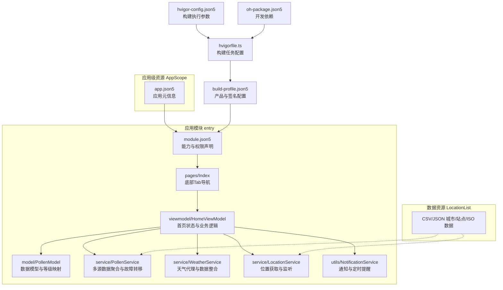
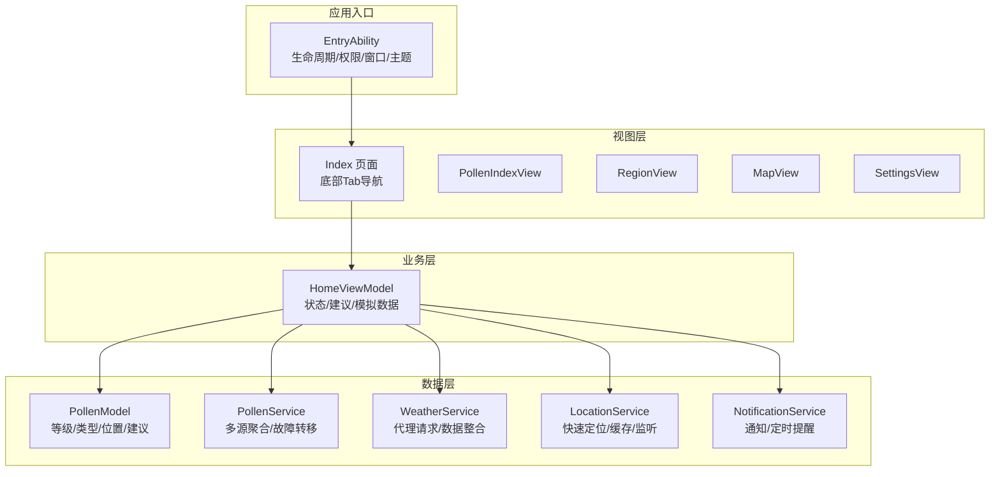
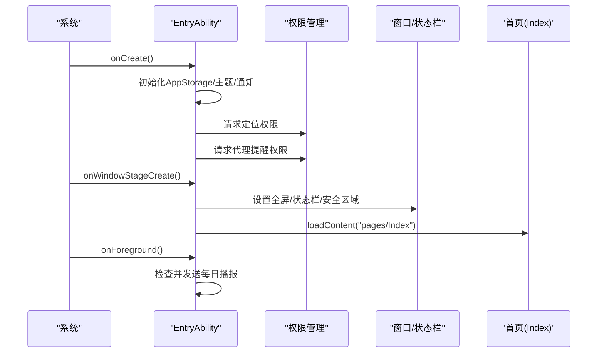
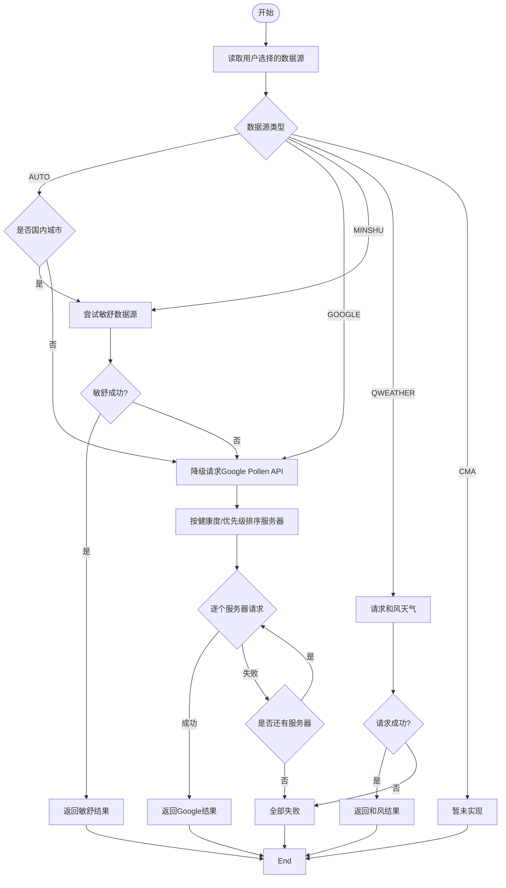
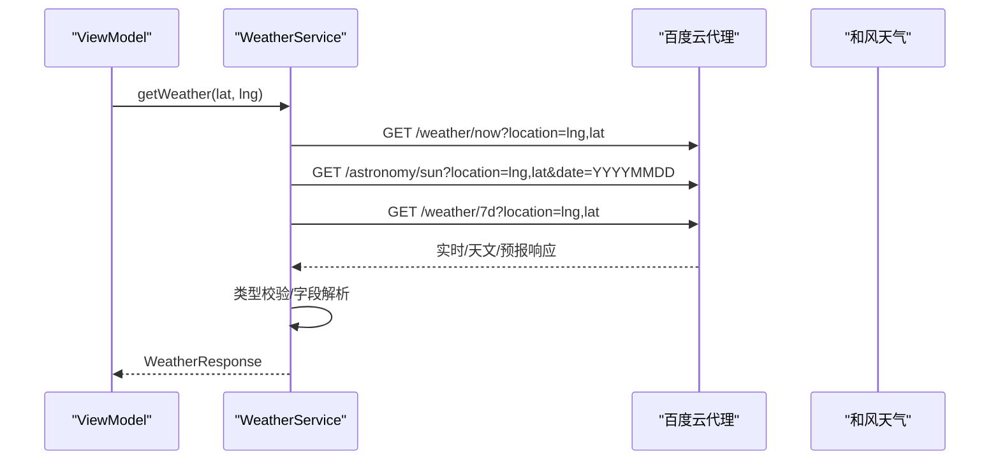
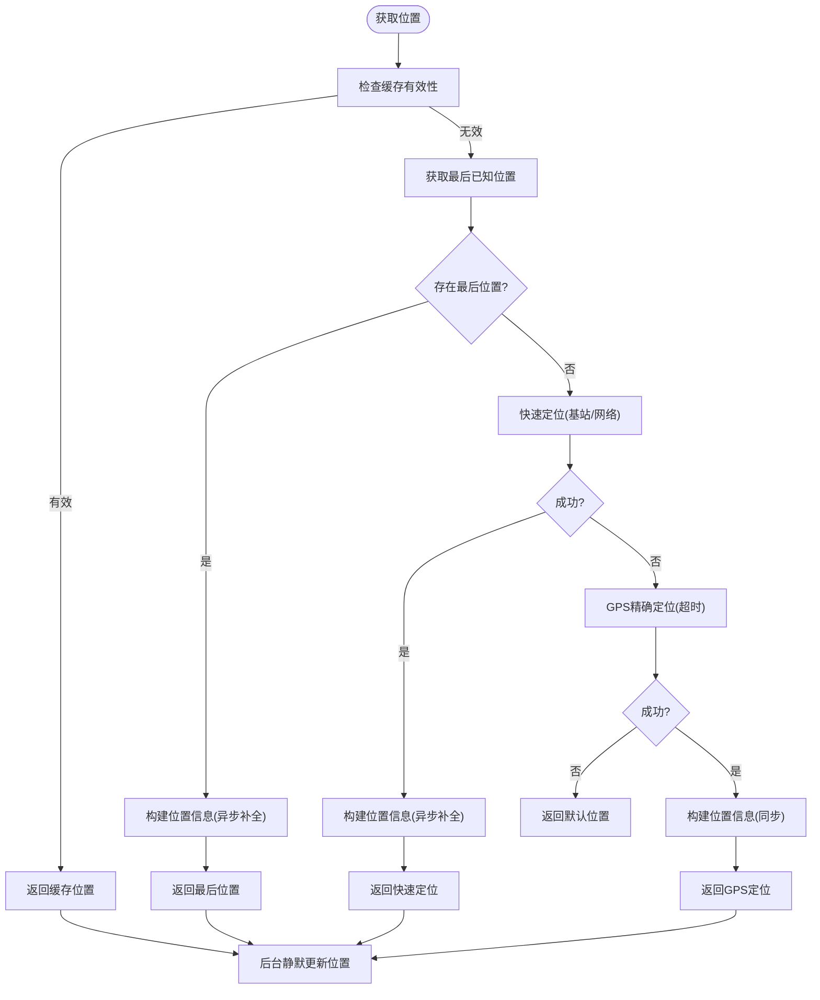
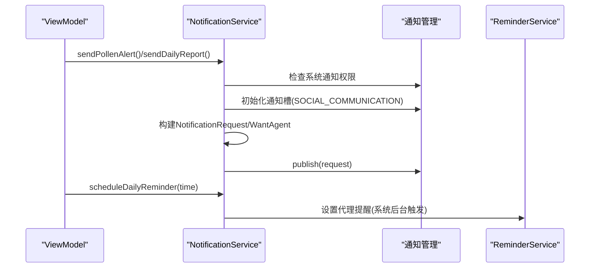
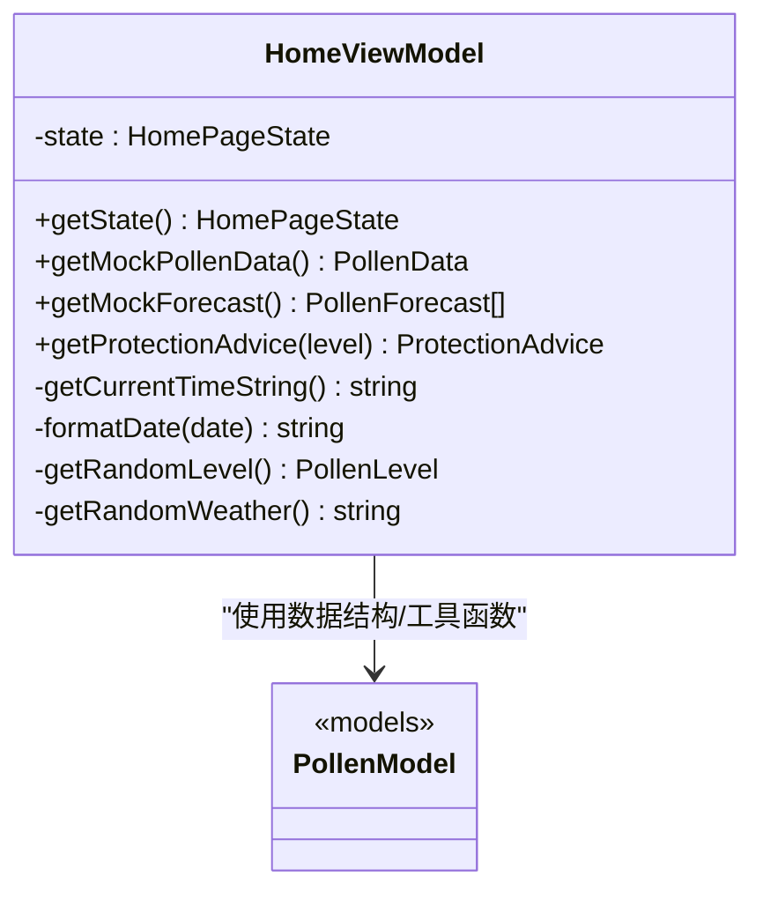
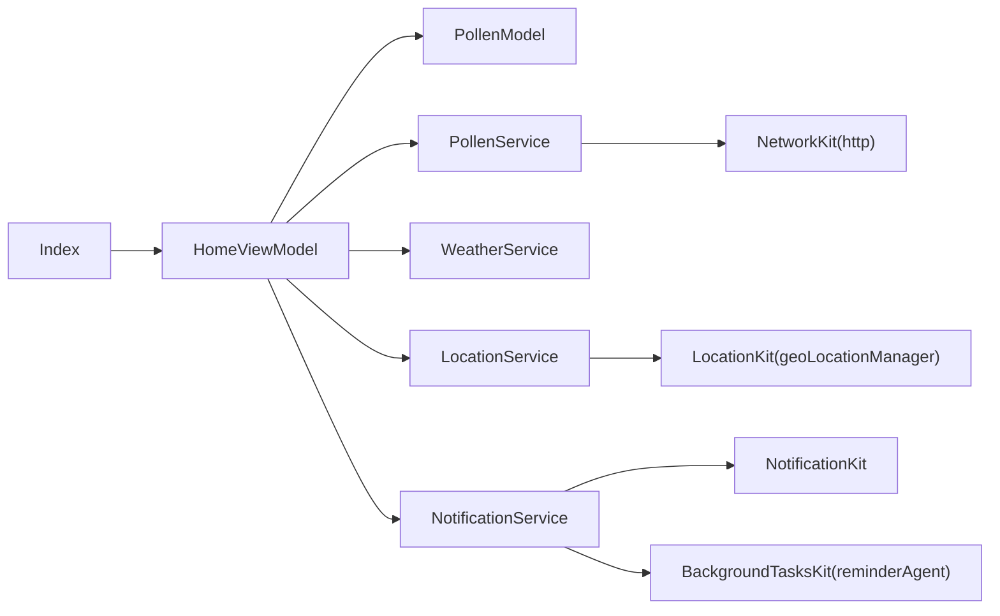

# 技术架构概览

<cite>
**本文引用的文件**
- [entry/src/main/module.json5](file://entry/src/main/module.json5)
- [entry/src/main/ets/entryability/EntryAbility.ets](file://entry/src/main/ets/entryability/EntryAbility.ets)
- [entry/src/main/ets/viewmodel/HomeViewModel.ets](file://entry/src/main/ets/viewmodel/HomeViewModel.ets)
- [entry/src/main/ets/model/PollenModel.ets](file://entry/src/main/ets/model/PollenModel.ets)
- [entry/src/main/ets/service/PollenService.ets](file://entry/src/main/ets/service/PollenService.ets)
- [entry/src/main/ets/service/WeatherService.ets](file://entry/src/main/ets/service/WeatherService.ets)
- [entry/src/main/ets/service/LocationService.ets](file://entry/src/main/ets/service/LocationService.ets)
- [entry/src/main/ets/utils/NotificationService.ets](file://entry/src/main/ets/utils/NotificationService.ets)
- [entry/src/main/resources/base/profile/main_pages.json](file://entry/src/main/resources/base/profile/main_pages.json)
- [entry/hvigorfile.ts](file://entry/hvigorfile.ts)
- [build-profile.json5](file://build-profile.json5)
- [hvigor/hvigor-config.json5](file://hvigor/hvigor-config.json5)
- [oh-package.json5](file://oh-package.json5)
- [AppScope/app.json5](file://AppScope/app.json5)
- [entry/src/main/ets/pages/Index.ets](file://entry/src/main/ets/pages/Index.ets)
</cite>

## 目录
1. [引言](#引言)
2. [项目结构](#项目结构)
3. [核心组件](#核心组件)
4. [架构总览](#架构总览)
5. [详细组件分析](#详细组件分析)
6. [依赖关系分析](#依赖关系分析)
7. [性能考量](#性能考量)
8. [故障排查指南](#故障排查指南)
9. [结论](#结论)
10. [附录](#附录)

## 引言
本文件面向PollenForecast项目，提供HarmonyOS生态下的技术架构概览与深入解读。文档聚焦以下目标：
- 阐述HarmonyOS应用架构与ArkTS/ETS作为主要开发语言的优势与特性
- 描述模块化架构设计：entry主应用模块、AppScope应用级资源、LocationList数据资源等
- 解释MVVM架构模式在项目中的落地：视图层、业务层、数据层的职责分离
- 介绍关键技术组件与第三方服务集成：Map Kit、Network Kit、Location Kit、Notification Kit、BackgroundTasks Kit等
- 说明构建工具hvigor的使用与配置，以及项目的依赖管理策略

## 项目结构
PollenForecast采用模块化组织方式，核心由entry主模块、AppScope应用级资源、以及数据资源目录组成。entry模块内按职责划分为model、service、utils、viewmodel、views、pages、widget等子目录，遵循MVVM分层与功能解耦。

图表来源
- [entry/src/main/module.json5](file://entry/src/main/module.json5#L1-L122)
- [entry/src/main/ets/pages/Index.ets](file://entry/src/main/ets/pages/Index.ets#L1-L97)
- [entry/src/main/ets/viewmodel/HomeViewModel.ets](file://entry/src/main/ets/viewmodel/HomeViewModel.ets#L1-L218)
- [entry/src/main/ets/model/PollenModel.ets](file://entry/src/main/ets/model/PollenModel.ets#L1-L160)
- [entry/src/main/ets/service/PollenService.ets](file://entry/src/main/ets/service/PollenService.ets#L1-L438)
- [entry/src/main/ets/service/WeatherService.ets](file://entry/src/main/ets/service/WeatherService.ets#L1-L232)
- [entry/src/main/ets/service/LocationService.ets](file://entry/src/main/ets/service/LocationService.ets#L1-L551)
- [entry/src/main/ets/utils/NotificationService.ets](file://entry/src/main/ets/utils/NotificationService.ets#L1-L355)
- [AppScope/app.json5](file://AppScope/app.json5#L1-L11)
- [entry/hvigorfile.ts](file://entry/hvigorfile.ts#L1-L6)
- [build-profile.json5](file://build-profile.json5#L1-L57)
- [hvigor/hvigor-config.json5](file://hvigor/hvigor-config.json5#L1-L24)
- [oh-package.json5](file://oh-package.json5#L1-L11)

章节来源
- [entry/src/main/module.json5](file://entry/src/main/module.json5#L1-L122)
- [entry/src/main/resources/base/profile/main_pages.json](file://entry/src/main/resources/base/profile/main_pages.json#L1-L8)
- [entry/hvigorfile.ts](file://entry/hvigorfile.ts#L1-L6)
- [build-profile.json5](file://build-profile.json5#L1-L57)
- [hvigor/hvigor-config.json5](file://hvigor/hvigor-config.json5#L1-L24)
- [oh-package.json5](file://oh-package.json5#L1-L11)
- [AppScope/app.json5](file://AppScope/app.json5#L1-L11)

## 核心组件
- 视图层（Views/Pages）：Index页面承载底部Tab导航，分别挂载花粉指数、区域、地图、设置四个子视图；通过@StorageLink绑定AppStorage实现跨组件状态同步。
- 业务层（ViewModel/Service）：HomeViewModel负责首页状态管理与模拟数据；PollenService/WeatherService封装网络请求与多源数据聚合；LocationService提供位置获取、缓存与监听；NotificationService负责通知与定时提醒。
- 数据层（Model/Utils）：PollenModel定义花粉等级、类型、位置与防护建议等数据结构；辅助工具如VibrationUtils、WidgetUpdateUtils等支撑交互体验。
- 应用级资源（AppScope）：AppScope/app.json5集中声明应用元信息，entry模块通过module.json5声明页面、权限与扩展能力。
- 构建与配置：hvigorfile.ts定义构建任务，build-profile.json5定义产品签名与SDK版本，hvigor-config.json5控制构建执行参数，oh-package.json5声明开发依赖。

章节来源
- [entry/src/main/ets/pages/Index.ets](file://entry/src/main/ets/pages/Index.ets#L1-L97)
- [entry/src/main/ets/viewmodel/HomeViewModel.ets](file://entry/src/main/ets/viewmodel/HomeViewModel.ets#L1-L218)
- [entry/src/main/ets/model/PollenModel.ets](file://entry/src/main/ets/model/PollenModel.ets#L1-L160)
- [entry/src/main/ets/service/PollenService.ets](file://entry/src/main/ets/service/PollenService.ets#L1-L438)
- [entry/src/main/ets/service/WeatherService.ets](file://entry/src/main/ets/service/WeatherService.ets#L1-L232)
- [entry/src/main/ets/service/LocationService.ets](file://entry/src/main/ets/service/LocationService.ets#L1-L551)
- [entry/src/main/ets/utils/NotificationService.ets](file://entry/src/main/ets/utils/NotificationService.ets#L1-L355)
- [AppScope/app.json5](file://AppScope/app.json5#L1-L11)

## 架构总览
PollenForecast采用MVVM架构，EntryAbility作为应用生命周期入口，负责初始化AppStorage、主题与安全区域、权限请求，并加载首页内容。视图层通过@State/@StorageLink与AppStorage联动，ViewModel承担状态与业务逻辑，Service层封装网络与位置能力，Model层定义数据契约，Utils提供通用工具。

图表来源
- [entry/src/main/ets/entryability/EntryAbility.ets](file://entry/src/main/ets/entryability/EntryAbility.ets#L1-L319)
- [entry/src/main/ets/pages/Index.ets](file://entry/src/main/ets/pages/Index.ets#L1-L97)
- [entry/src/main/ets/viewmodel/HomeViewModel.ets](file://entry/src/main/ets/viewmodel/HomeViewModel.ets#L1-L218)
- [entry/src/main/ets/model/PollenModel.ets](file://entry/src/main/ets/model/PollenModel.ets#L1-L160)
- [entry/src/main/ets/service/PollenService.ets](file://entry/src/main/ets/service/PollenService.ets#L1-L438)
- [entry/src/main/ets/service/WeatherService.ets](file://entry/src/main/ets/service/WeatherService.ets#L1-L232)
- [entry/src/main/ets/service/LocationService.ets](file://entry/src/main/ets/service/LocationService.ets#L1-L551)
- [entry/src/main/ets/utils/NotificationService.ets](file://entry/src/main/ets/utils/NotificationService.ets#L1-L355)

## 详细组件分析

### EntryAbility：应用生命周期与权限管理
- 职责
  - 初始化AppStorage与持久化属性
  - 设置主题与状态栏样式
  - 请求定位与代理提醒权限
  - 加载首页内容并处理前后台切换
- 关键流程
  - onCreate：初始化AppStorage、主题色、通知开关、位置上下文
  - onWindowStageCreate：请求权限、设置沉浸式状态栏、计算安全区域、加载首页
  - onForeground：应用回到前台时检查并发送每日播报
  - onConfigurationUpdate：响应主题切换，动态更新状态栏

图表来源
- [entry/src/main/ets/entryability/EntryAbility.ets](file://entry/src/main/ets/entryability/EntryAbility.ets#L1-L319)
- [entry/src/main/resources/base/profile/main_pages.json](file://entry/src/main/resources/base/profile/main_pages.json#L1-L8)

章节来源
- [entry/src/main/ets/entryability/EntryAbility.ets](file://entry/src/main/ets/entryability/EntryAbility.ets#L1-L319)

### PollenService：多源数据聚合与故障转移
- 职责
  - 支持多服务器故障转移，提升可用性
  - 支持用户选择数据源（AUTO/GOOGLE/MINSHU/QWEATHER/CMA）
  - 国内城市优先敏舒，失败后降级Google
- 关键机制
  - 服务器健康状态缓存与重试策略
  - 多服务器排序与请求轮询
  - 响应解析与错误处理

图表来源
- [entry/src/main/ets/service/PollenService.ets](file://entry/src/main/ets/service/PollenService.ets#L1-L438)

章节来源
- [entry/src/main/ets/service/PollenService.ets](file://entry/src/main/ets/service/PollenService.ets#L1-L438)

### WeatherService：天气代理与数据整合
- 职责
  - 通过百度云广州代理访问和风天气API，隐藏真实密钥
  - 并行请求实时天气、日出日落与7日预报，整合为统一响应
- 关键点
  - 并发请求与类型校验
  - 天气描述与温度范围解析
  - 超时与异常处理

图表来源
- [entry/src/main/ets/service/WeatherService.ets](file://entry/src/main/ets/service/WeatherService.ets#L1-L232)

章节来源
- [entry/src/main/ets/service/WeatherService.ets](file://entry/src/main/ets/service/WeatherService.ets#L1-L232)

### LocationService：快速定位、缓存与监听
- 职责
  - 快速定位优先返回缓存或最后位置，后台静默刷新
  - GPS精确定位策略与监听事件
  - 逆地理编码异步补全城市与地址
- 关键点
  - 缓存有效期与距离阈值更新
  - 多策略组合与超时控制
  - 回调通知订阅者

图表来源
- [entry/src/main/ets/service/LocationService.ets](file://entry/src/main/ets/service/LocationService.ets#L1-L551)

章节来源
- [entry/src/main/ets/service/LocationService.ets](file://entry/src/main/ets/service/LocationService.ets#L1-L551)

### NotificationService：通知与定时提醒
- 职责
  - 花粉预警通知与每日播报通知
  - 通知渠道初始化与权限检查
  - 基于代理提醒（ReminderAgent）实现后台定时
- 关键点
  - AppStorage控制开关与时间配置
  - WantAgent跳转到首页指定路由
  - 取消与清理

图表来源
- [entry/src/main/ets/utils/NotificationService.ets](file://entry/src/main/ets/utils/NotificationService.ets#L1-L355)

章节来源
- [entry/src/main/ets/utils/NotificationService.ets](file://entry/src/main/ets/utils/NotificationService.ets#L1-L355)

### HomeViewModel：状态管理与业务逻辑
- 职责
  - 维护首页状态：加载中、当前花粉、7天预报、防护建议、错误信息、最后更新时间
  - 提供模拟数据与随机天气/温度生成
  - 提供等级颜色/文本/表情等展示工具函数
- 关键点
  - 与AppStorage联动，驱动视图更新
  - 与PollenService/WeatherService协作获取真实数据

图表来源
- [entry/src/main/ets/viewmodel/HomeViewModel.ets](file://entry/src/main/ets/viewmodel/HomeViewModel.ets#L1-L218)
- [entry/src/main/ets/model/PollenModel.ets](file://entry/src/main/ets/model/PollenModel.ets#L1-L160)

章节来源
- [entry/src/main/ets/viewmodel/HomeViewModel.ets](file://entry/src/main/ets/viewmodel/HomeViewModel.ets#L1-L218)
- [entry/src/main/ets/model/PollenModel.ets](file://entry/src/main/ets/model/PollenModel.ets#L1-L160)

### Index页面：MVVM入口与Tab导航
- 职责
  - 定义底部Tab导航，承载四个页面
  - 通过@StorageLink绑定安全区域与主题色
  - 切换Tab时触发轻微震动反馈
- 关键点
  - 与AppStorage联动，响应主题与安全区域变化
  - 作为ViewModel与各视图的粘合层

章节来源
- [entry/src/main/ets/pages/Index.ets](file://entry/src/main/ets/pages/Index.ets#L1-L97)

## 依赖关系分析
- 模块依赖
  - entry模块通过module.json5声明页面、能力与扩展（备份/窗形/表单），并声明所需权限
  - hvigorfile.ts引入系统构建任务，build-profile.json5定义产品签名与SDK版本
  - hvigor-config.json5提供构建执行参数（如并行、增量编译等）
  - oh-package.json5声明测试框架与模拟库
- 组件耦合
  - View层依赖ViewModel；ViewModel依赖Service与Model
  - Service层依赖HarmonyOS Kit（Network/Location/Notification/BackgroundTasks）
  - Utils层提供横切关注点（通知、振动、Widget更新）

图表来源
- [entry/src/main/ets/pages/Index.ets](file://entry/src/main/ets/pages/Index.ets#L1-L97)
- [entry/src/main/ets/viewmodel/HomeViewModel.ets](file://entry/src/main/ets/viewmodel/HomeViewModel.ets#L1-L218)
- [entry/src/main/ets/service/PollenService.ets](file://entry/src/main/ets/service/PollenService.ets#L1-L438)
- [entry/src/main/ets/service/WeatherService.ets](file://entry/src/main/ets/service/WeatherService.ets#L1-L232)
- [entry/src/main/ets/service/LocationService.ets](file://entry/src/main/ets/service/LocationService.ets#L1-L551)
- [entry/src/main/ets/utils/NotificationService.ets](file://entry/src/main/ets/utils/NotificationService.ets#L1-L355)

章节来源
- [entry/src/main/module.json5](file://entry/src/main/module.json5#L1-L122)
- [entry/hvigorfile.ts](file://entry/hvigorfile.ts#L1-L6)
- [build-profile.json5](file://build-profile.json5#L1-L57)
- [hvigor/hvigor-config.json5](file://hvigor/hvigor-config.json5#L1-L24)
- [oh-package.json5](file://oh-package.json5#L1-L11)

## 性能考量
- 位置服务
  - 快速定位优先使用缓存与最后位置，降低首屏延迟
  - 后台静默更新与监听结合，避免阻塞UI
  - GPS策略设置合理超时与精度阈值
- 网络请求
  - PollenService多服务器故障转移与健康检查，提升成功率
  - WeatherService并行请求实时/天文/预报，缩短等待时间
- 视图渲染
  - AppStorage双向绑定减少重复渲染
  - Tab切换触发轻量震动反馈，避免重型操作
- 构建优化
  - hvigor支持并行与增量编译，建议在hvigor-config.json5中按需开启

## 故障排查指南
- 权限问题
  - 定位权限与代理提醒权限需在运行时请求，若被拒绝会影响位置与定时提醒功能
  - 检查EntryAbility中的权限请求流程与日志输出
- 通知问题
  - 确认系统通知权限已开启，且通知槽已初始化
  - 检查AppStorage中的开关与时间配置
- 位置问题
  - 若位置服务未启用或定位失败，将回退到默认位置
  - 检查LocationService的监听与缓存更新逻辑
- 网络问题
  - PollenService会记录服务器失败次数与健康状态，必要时重置状态
  - WeatherService对HTTP响应进行类型校验与错误码判断

章节来源
- [entry/src/main/ets/entryability/EntryAbility.ets](file://entry/src/main/ets/entryability/EntryAbility.ets#L1-L319)
- [entry/src/main/ets/utils/NotificationService.ets](file://entry/src/main/ets/utils/NotificationService.ets#L1-L355)
- [entry/src/main/ets/service/LocationService.ets](file://entry/src/main/ets/service/LocationService.ets#L1-L551)
- [entry/src/main/ets/service/PollenService.ets](file://entry/src/main/ets/service/PollenService.ets#L1-L438)
- [entry/src/main/ets/service/WeatherService.ets](file://entry/src/main/ets/service/WeatherService.ets#L1-L232)

## 结论
PollenForecast在HarmonyOS生态下采用清晰的MVVM分层与模块化设计，通过ArkTS/ETS实现高性能与易维护的用户体验。EntryAbility统一管理应用生命周期与权限，ViewModel集中处理状态与业务逻辑，Service层封装网络与位置能力，配合AppScope与资源目录实现可扩展的工程化组织。结合hvigor构建体系与Kit生态，项目具备良好的可维护性与可扩展性。

## 附录
- ArkTS/ETS优势与特性
  - 强类型与静态检查，降低运行时错误
  - 与HarmonyOS Kit深度集成，简化系统能力接入
  - 响应式状态管理（@State/@StorageLink/AppStorage）提升开发效率
- 第三方服务集成要点
  - Network Kit：统一HTTP请求与超时控制
  - Location Kit：多策略定位与监听
  - Notification Kit：系统通知与渠道管理
  - BackgroundTasks Kit：代理提醒实现后台定时
- 构建与发布
  - hvigorfile.ts引入系统任务，build-profile.json5配置签名与SDK版本
  - hvigor-config.json5按需启用并行/增量编译等优化
  - oh-package.json5声明测试与模拟依赖