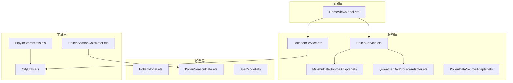
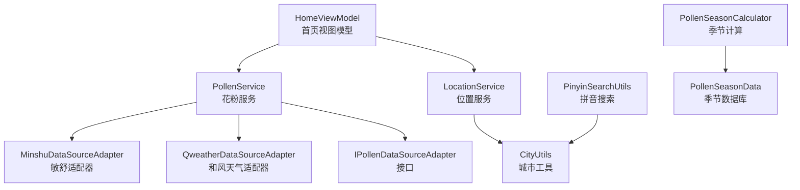
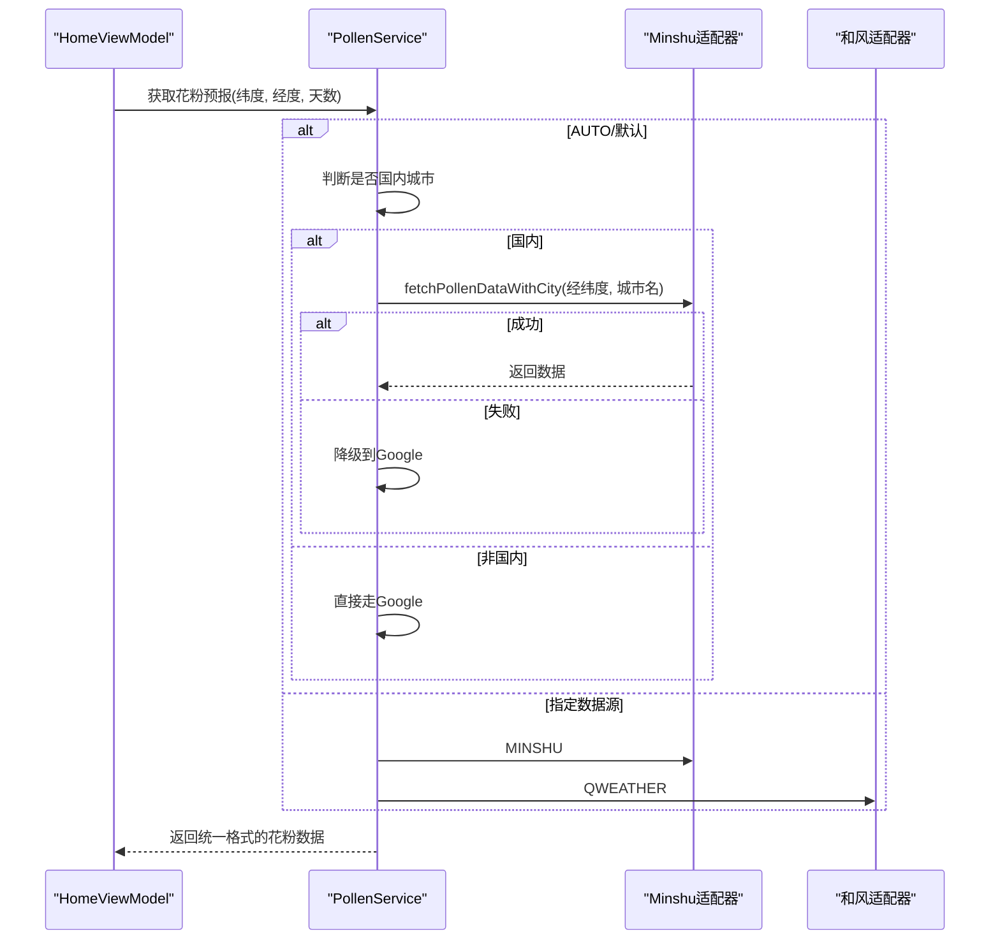
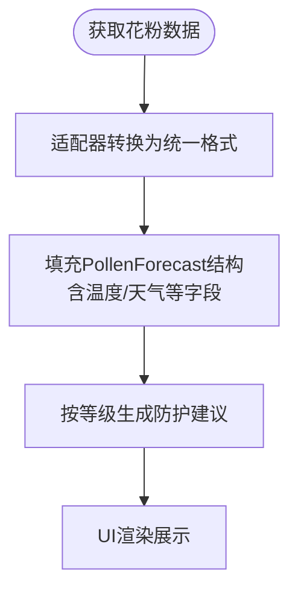
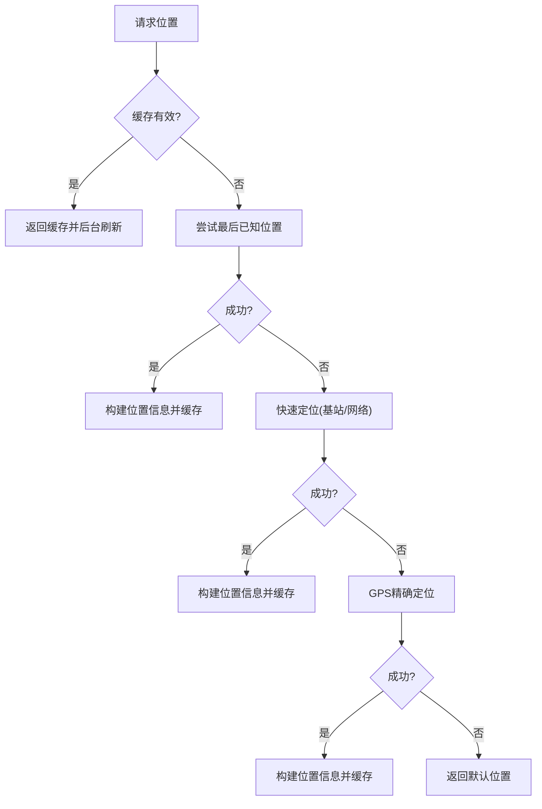
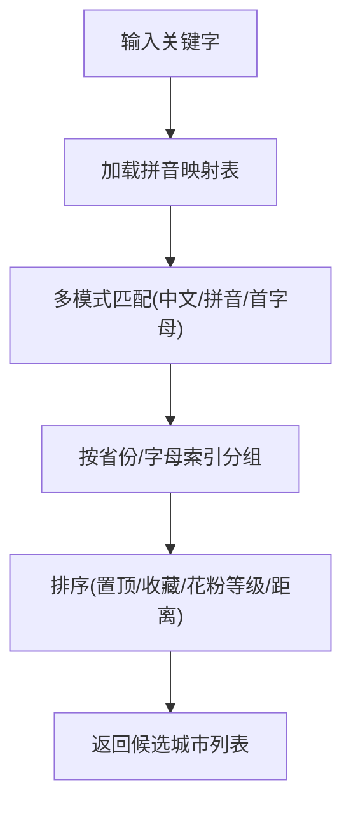
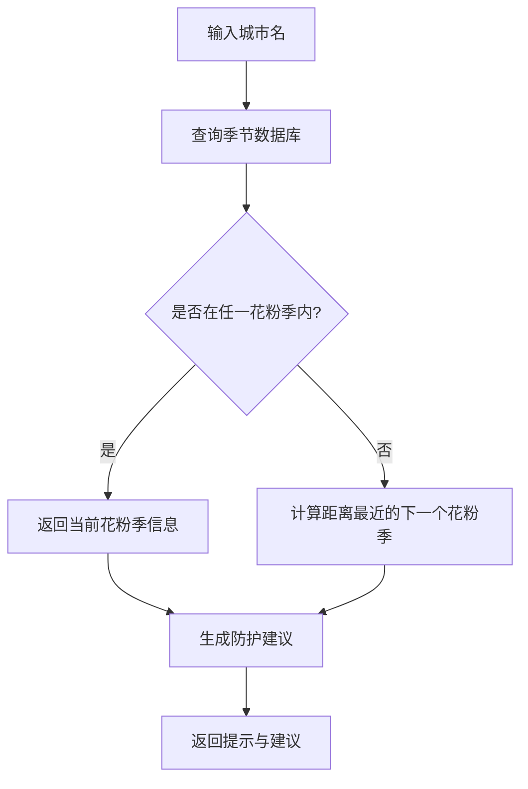
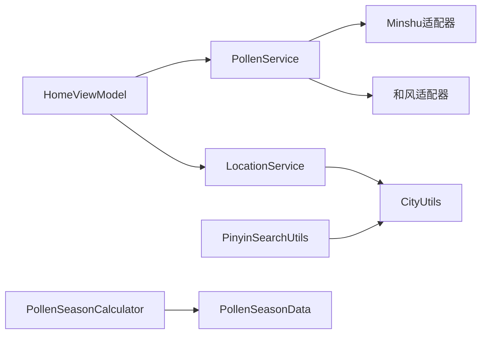

# 核心特性说明

<cite>
**本文引用的文件**
- [PollenDataSource.ets](file://entry/src/main/ets/model/PollenDataSource.ets)
- [PollenDataSourceAdapter.ets](file://entry/src/main/ets/service/PollenDataSourceAdapter.ets)
- [MinshuDataSourceAdapter.ets](file://entry/src/main/ets/service/MinshuDataSourceAdapter.ets)
- [QweatherDataSourceAdapter.ets](file://entry/src/main/ets/service/QweatherDataSourceAdapter.ets)
- [PollenService.ets](file://entry/src/main/ets/service/PollenService.ets)
- [PollenModel.ets](file://entry/src/main/ets/model/PollenModel.ets)
- [LocationService.ets](file://entry/src/main/ets/service/LocationService.ets)
- [PinyinSearchUtils.ets](file://entry/src/main/ets/utils/PinyinSearchUtils.ets)
- [CityUtils.ets](file://entry/src/main/ets/utils/CityUtils.ets)
- [PollenSeasonData.ets](file://entry/src/main/ets/model/PollenSeasonData.ets)
- [PollenSeasonCalculator.ets](file://entry/src/main/ets/utils/PollenSeasonCalculator.ets)
- [HomeViewModel.ets](file://entry/src/main/ets/viewmodel/HomeViewModel.ets)
- [UserModel.ets](file://entry/src/main/ets/model/UserModel.ets)
</cite>

## 目录
1. [简介](#简介)
2. [项目结构](#项目结构)
3. [核心组件](#核心组件)
4. [架构总览](#架构总览)
5. [详细组件分析](#详细组件分析)
6. [依赖关系分析](#依赖关系分析)
7. [性能考量](#性能考量)
8. [故障排查指南](#故障排查指南)
9. [结论](#结论)
10. [附录](#附录)

## 简介
本文件面向PollenForecast项目的“核心特性”，围绕以下能力进行系统化说明：
- 花粉浓度数据获取与展示：多数据源支持（Google Pollen API、敏舒数据源、和风天气），以及自动/手动选择与故障转移机制
- 天气信息集成：温度、湿度、风力等气象数据的获取与展示思路
- 位置服务：GPS精确定位、缓存定位策略、位置监听机制
- 城市搜索与导航：拼音搜索、地理位置查询、城市列表管理
- 季节性功能：花粉季节判断算法与个性化防护建议生成
- 个性化设置：主题、震动反馈、通知提醒等用户偏好

## 项目结构
项目采用按职责分层的组织方式：
- model：定义数据模型与领域常量（花粉等级、类型、季节数据等）
- service：数据源适配器与服务层（位置、花粉、天气）
- utils：工具类（拼音搜索、城市工具、季节计算等）
- viewmodel：页面状态与业务逻辑（首页视图模型）
- pages/views/widget：UI 页面与组件（入口页面、设置页、卡片等）

图表来源
- [PollenModel.ets](file://entry/src/main/ets/model/PollenModel.ets#L1-L160)
- [PollenSeasonData.ets](file://entry/src/main/ets/model/PollenSeasonData.ets#L1-L439)
- [UserModel.ets](file://entry/src/main/ets/model/UserModel.ets#L1-L120)
- [LocationService.ets](file://entry/src/main/ets/service/LocationService.ets#L1-L551)
- [PollenService.ets](file://entry/src/main/ets/service/PollenService.ets#L1-L438)
- [MinshuDataSourceAdapter.ets](file://entry/src/main/ets/service/MinshuDataSourceAdapter.ets#L1-L315)
- [QweatherDataSourceAdapter.ets](file://entry/src/main/ets/service/QweatherDataSourceAdapter.ets#L1-L220)
- [PollenDataSourceAdapter.ets](file://entry/src/main/ets/service/PollenDataSourceAdapter.ets#L1-L32)
- [PinyinSearchUtils.ets](file://entry/src/main/ets/utils/PinyinSearchUtils.ets#L1-L127)
- [CityUtils.ets](file://entry/src/main/ets/utils/CityUtils.ets#L1-L428)
- [PollenSeasonCalculator.ets](file://entry/src/main/ets/utils/PollenSeasonCalculator.ets#L1-L209)
- [HomeViewModel.ets](file://entry/src/main/ets/viewmodel/HomeViewModel.ets#L1-L218)

章节来源
- [PollenModel.ets](file://entry/src/main/ets/model/PollenModel.ets#L1-L160)
- [PollenService.ets](file://entry/src/main/ets/service/PollenService.ets#L1-L438)
- [LocationService.ets](file://entry/src/main/ets/service/LocationService.ets#L1-L551)
- [PinyinSearchUtils.ets](file://entry/src/main/ets/utils/PinyinSearchUtils.ets#L1-L127)
- [CityUtils.ets](file://entry/src/main/ets/utils/CityUtils.ets#L1-L428)
- [PollenSeasonData.ets](file://entry/src/main/ets/model/PollenSeasonData.ets#L1-L439)
- [PollenSeasonCalculator.ets](file://entry/src/main/ets/utils/PollenSeasonCalculator.ets#L1-L209)
- [HomeViewModel.ets](file://entry/src/main/ets/viewmodel/HomeViewModel.ets#L1-L218)
- [UserModel.ets](file://entry/src/main/ets/model/UserModel.ets#L1-L120)

## 核心组件
- 花粉数据模型与等级体系：定义花粉等级、类型、位置信息、防护建议等，提供颜色、文本、表情等渲染辅助
- 数据源配置与适配器：统一接口IPollenDataSourceAdapter，分别对接敏舒、和风天气；Google Pollen API由PollenService多服务器故障转移实现
- 位置服务：快速定位、缓存、监听、权限申请与逆地理编码
- 城市与拼音工具：拼音映射、搜索、分组、排序与索引
- 季节性工具：基于城市花粉季节数据库的判断与提示
- 首页视图模型：聚合花粉数据、预报、建议与更新时间

章节来源
- [PollenModel.ets](file://entry/src/main/ets/model/PollenModel.ets#L1-L160)
- [PollenDataSource.ets](file://entry/src/main/ets/model/PollenDataSource.ets#L1-L105)
- [PollenDataSourceAdapter.ets](file://entry/src/main/ets/service/PollenDataSourceAdapter.ets#L1-L32)
- [MinshuDataSourceAdapter.ets](file://entry/src/main/ets/service/MinshuDataSourceAdapter.ets#L1-L315)
- [QweatherDataSourceAdapter.ets](file://entry/src/main/ets/service/QweatherDataSourceAdapter.ets#L1-L220)
- [PollenService.ets](file://entry/src/main/ets/service/PollenService.ets#L1-L438)
- [LocationService.ets](file://entry/src/main/ets/service/LocationService.ets#L1-L551)
- [PinyinSearchUtils.ets](file://entry/src/main/ets/utils/PinyinSearchUtils.ets#L1-L127)
- [CityUtils.ets](file://entry/src/main/ets/utils/CityUtils.ets#L1-L428)
- [PollenSeasonData.ets](file://entry/src/main/ets/model/PollenSeasonData.ets#L1-L439)
- [PollenSeasonCalculator.ets](file://entry/src/main/ets/utils/PollenSeasonCalculator.ets#L1-L209)
- [HomeViewModel.ets](file://entry/src/main/ets/viewmodel/HomeViewModel.ets#L1-L218)

## 架构总览
整体采用“视图模型-服务-适配器-数据源”的分层架构。视图模型负责UI状态与业务逻辑；服务层负责数据聚合、策略选择与故障转移；适配器负责与具体数据源的协议转换；工具层提供搜索、排序、季节判断等通用能力。

图表来源
- [HomeViewModel.ets](file://entry/src/main/ets/viewmodel/HomeViewModel.ets#L1-L218)
- [PollenService.ets](file://entry/src/main/ets/service/PollenService.ets#L1-L438)
- [MinshuDataSourceAdapter.ets](file://entry/src/main/ets/service/MinshuDataSourceAdapter.ets#L1-L315)
- [QweatherDataSourceAdapter.ets](file://entry/src/main/ets/service/QweatherDataSourceAdapter.ets#L1-L220)
- [PollenDataSourceAdapter.ets](file://entry/src/main/ets/service/PollenDataSourceAdapter.ets#L1-L32)
- [LocationService.ets](file://entry/src/main/ets/service/LocationService.ets#L1-L551)
- [CityUtils.ets](file://entry/src/main/ets/utils/CityUtils.ets#L1-L428)
- [PinyinSearchUtils.ets](file://entry/src/main/ets/utils/PinyinSearchUtils.ets#L1-L127)
- [PollenSeasonData.ets](file://entry/src/main/ets/model/PollenSeasonData.ets#L1-L439)
- [PollenSeasonCalculator.ets](file://entry/src/main/ets/utils/PollenSeasonCalculator.ets#L1-L209)

## 详细组件分析

### 花粉数据获取与展示（多数据源与故障转移）
- 数据源配置：提供枚举与配置列表，支持AUTO、GOOGLE、MINSHU、CMA、QWEATHER五种类型
- 适配器接口：统一fetchPollenData与isAvailable方法，便于扩展新数据源
- 敏舒适配器：将敏舒API响应转换为内部格式，支持adcode与城市名转换
- 和风天气适配器：将Indices API转换为内部格式，支持健康建议提取
- PollenService：统一调度与故障转移
  - 多服务器健康状态维护与排序
  - 自动选择策略：国内城市优先敏舒，失败后降级Google；非国内直接走Google
  - 服务器失败计数与重试窗口控制

图表来源
- [PollenService.ets](file://entry/src/main/ets/service/PollenService.ets#L232-L406)
- [MinshuDataSourceAdapter.ets](file://entry/src/main/ets/service/MinshuDataSourceAdapter.ets#L190-L314)
- [QweatherDataSourceAdapter.ets](file://entry/src/main/ets/service/QweatherDataSourceAdapter.ets#L146-L219)
- [HomeViewModel.ets](file://entry/src/main/ets/viewmodel/HomeViewModel.ets#L1-L218)

章节来源
- [PollenDataSource.ets](file://entry/src/main/ets/model/PollenDataSource.ets#L1-L105)
- [PollenDataSourceAdapter.ets](file://entry/src/main/ets/service/PollenDataSourceAdapter.ets#L1-L32)
- [MinshuDataSourceAdapter.ets](file://entry/src/main/ets/service/MinshuDataSourceAdapter.ets#L1-L315)
- [QweatherDataSourceAdapter.ets](file://entry/src/main/ets/service/QweatherDataSourceAdapter.ets#L1-L220)
- [PollenService.ets](file://entry/src/main/ets/service/PollenService.ets#L1-L438)
- [HomeViewModel.ets](file://entry/src/main/ets/viewmodel/HomeViewModel.ets#L1-L218)

### 天气信息集成（温度、湿度、风力）
- 数据模型：PollenModel定义了PollenForecast结构，包含日期、星期、等级、数值及可选的最高/最低温度与天气状况
- 适配器转换：和风天气适配器将Indices API中的文字描述转换为健康建议与等级，同时保留文本用于展示
- 展示建议：HomeViewModel提供按等级生成的防护建议，结合温度与天气状况增强用户体验

图表来源
- [PollenModel.ets](file://entry/src/main/ets/model/PollenModel.ets#L58-L79)
- [QweatherDataSourceAdapter.ets](file://entry/src/main/ets/service/QweatherDataSourceAdapter.ets#L124-L145)
- [HomeViewModel.ets](file://entry/src/main/ets/viewmodel/HomeViewModel.ets#L120-L184)

章节来源
- [PollenModel.ets](file://entry/src/main/ets/model/PollenModel.ets#L1-L160)
- [QweatherDataSourceAdapter.ets](file://entry/src/main/ets/service/QweatherDataSourceAdapter.ets#L1-L220)
- [HomeViewModel.ets](file://entry/src/main/ets/viewmodel/HomeViewModel.ets#L1-L218)

### 位置服务（GPS精确定位、缓存策略、位置监听）
- 快速定位：优先缓存，其次最后已知位置，再快速定位（基站/网络），失败返回默认位置
- 精确定位：GPS优先，超时与精度控制，后台继续获取更精确位置
- 缓存策略：5分钟有效期，偏差超过阈值才更新
- 位置监听：启动/停止监听，定时与移动距离触发，异步逆地理编码补充城市名
- 权限管理：检查与请求位置权限，授权后自动启动监听

图表来源
- [LocationService.ets](file://entry/src/main/ets/service/LocationService.ets#L120-L240)
- [LocationService.ets](file://entry/src/main/ets/service/LocationService.ets#L242-L353)
- [LocationService.ets](file://entry/src/main/ets/service/LocationService.ets#L354-L420)

章节来源
- [LocationService.ets](file://entry/src/main/ets/service/LocationService.ets#L1-L551)

### 城市搜索与导航（拼音搜索、地理位置查询、城市列表管理）
- 拼音搜索：支持中文名、完整拼音、首字母缩写、前缀匹配与片段匹配
- 城市工具：按省份/字母索引分组、搜索、排序（置顶/收藏/花粉等级/距离）
- 地理位置查询：与LocationService配合，逆地理编码获取城市名与地址
- 城市列表管理：支持收藏、置顶、距离与花粉等级排序

图表来源
- [PinyinSearchUtils.ets](file://entry/src/main/ets/utils/PinyinSearchUtils.ets#L1-L127)
- [CityUtils.ets](file://entry/src/main/ets/utils/CityUtils.ets#L232-L428)

章节来源
- [PinyinSearchUtils.ets](file://entry/src/main/ets/utils/PinyinSearchUtils.ets#L1-L127)
- [CityUtils.ets](file://entry/src/main/ets/utils/CityUtils.ets#L1-L428)

### 季节性功能（花粉季节判断与个性化建议）
- 季节数据库：内置主要城市的花粉季节周期、高峰月份、风险等级与主要过敏原
- 季节计算：判断当前是否在花粉季、计算下次花粉期、生成提示信息
- 个性化建议：根据当前花粉季生成防护建议，支持风险系数计算（来自用户档案）

图表来源
- [PollenSeasonData.ets](file://entry/src/main/ets/model/PollenSeasonData.ets#L1-L439)
- [PollenSeasonCalculator.ets](file://entry/src/main/ets/utils/PollenSeasonCalculator.ets#L73-L150)
- [PollenSeasonCalculator.ets](file://entry/src/main/ets/utils/PollenSeasonCalculator.ets#L151-L209)

章节来源
- [PollenSeasonData.ets](file://entry/src/main/ets/model/PollenSeasonData.ets#L1-L439)
- [PollenSeasonCalculator.ets](file://entry/src/main/ets/utils/PollenSeasonCalculator.ets#L1-L209)
- [UserModel.ets](file://entry/src/main/ets/model/UserModel.ets#L1-L120)

### 个性化设置（主题、震动反馈、通知提醒）
- 用户设置：包含预警阈值、通知时间、通知方式、主题模式、单位制、语言、自动定位、收藏城市等
- 预警设置：可启用/禁用预警、设定阈值、选择通知方式（推送、小部件、手表、声音）
- 个性化风险系数：根据过敏程度、哮喘、鼻炎、年龄等因素调整风险评估

章节来源
- [UserModel.ets](file://entry/src/main/ets/model/UserModel.ets#L1-L120)

## 依赖关系分析
- 低耦合高内聚：各数据源通过统一适配器接口解耦；服务层集中处理策略与故障转移
- 关键依赖链：
  - HomeViewModel依赖PollenService与LocationService
  - PollenService依赖Minshu/Qweather适配器与AppStorage中的用户选择
  - LocationService依赖系统定位能力与逆地理编码
  - 搜索与城市管理依赖拼音映射与城市工具
  - 季节性功能依赖季节数据库与计算器

图表来源
- [HomeViewModel.ets](file://entry/src/main/ets/viewmodel/HomeViewModel.ets#L1-L218)
- [PollenService.ets](file://entry/src/main/ets/service/PollenService.ets#L1-L438)
- [LocationService.ets](file://entry/src/main/ets/service/LocationService.ets#L1-L551)
- [CityUtils.ets](file://entry/src/main/ets/utils/CityUtils.ets#L1-L428)
- [PinyinSearchUtils.ets](file://entry/src/main/ets/utils/PinyinSearchUtils.ets#L1-L127)
- [PollenSeasonData.ets](file://entry/src/main/ets/model/PollenSeasonData.ets#L1-L439)
- [PollenSeasonCalculator.ets](file://entry/src/main/ets/utils/PollenSeasonCalculator.ets#L1-L209)

## 性能考量
- 定位性能：快速定位优先使用最后已知位置与基站/网络，GPS仅在需要时触发，降低耗时与电量消耗
- 缓存策略：位置缓存5分钟，后台静默刷新，避免频繁定位
- 服务器健康状态：失败计数与重试窗口，减少无效请求
- 数据转换：适配器内统一转换逻辑，避免重复解析与格式化
- UI渲染：等级到颜色/文本/表情的映射在模型层集中定义，减少页面重复计算

## 故障排查指南
- 花粉数据为空
  - 检查数据源选择与网络状态
  - 查看PollenService服务器健康状态与失败计数
  - 确认敏舒所需城市名与adcode是否正确
- 定位失败
  - 检查位置权限是否授予
  - 确认设备位置服务已开启
  - 观察快速定位与GPS定位流程日志
- 城市搜索无结果
  - 确认拼音映射表加载成功
  - 检查关键字匹配模式（中文/拼音/首字母）
- 季节提示异常
  - 确认城市名与数据库条目一致
  - 检查当前日期是否跨越月份边界

章节来源
- [PollenService.ets](file://entry/src/main/ets/service/PollenService.ets#L408-L437)
- [MinshuDataSourceAdapter.ets](file://entry/src/main/ets/service/MinshuDataSourceAdapter.ets#L190-L314)
- [LocationService.ets](file://entry/src/main/ets/service/LocationService.ets#L68-L118)
- [PinyinSearchUtils.ets](file://entry/src/main/ets/utils/PinyinSearchUtils.ets#L1-L127)
- [PollenSeasonCalculator.ets](file://entry/src/main/ets/utils/PollenSeasonCalculator.ets#L73-L150)

## 结论
PollenForecast通过清晰的分层设计与统一的适配器接口，实现了多数据源的灵活接入与稳定运行；结合位置服务、城市搜索与季节性功能，形成了完整的花粉信息服务闭环；个性化设置与防护建议进一步提升了用户体验与实用性。

## 附录
- 数据模型与等级映射：参考花粉等级到颜色、背景色、文本与表情的映射
- 首页视图模型：提供模拟数据与防护建议生成，便于开发与测试

章节来源
- [PollenModel.ets](file://entry/src/main/ets/model/PollenModel.ets#L80-L160)
- [HomeViewModel.ets](file://entry/src/main/ets/viewmodel/HomeViewModel.ets#L120-L184)