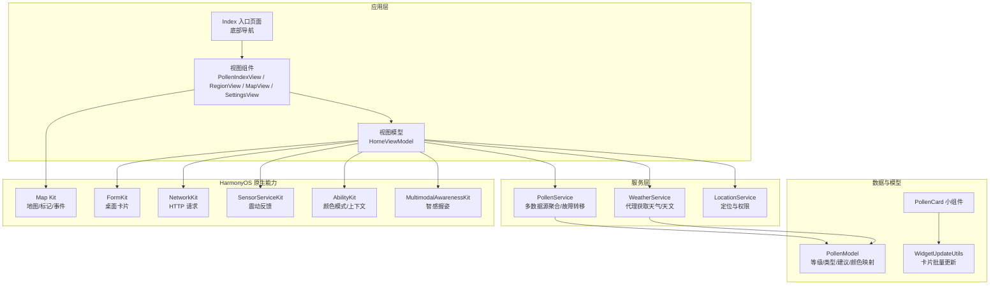
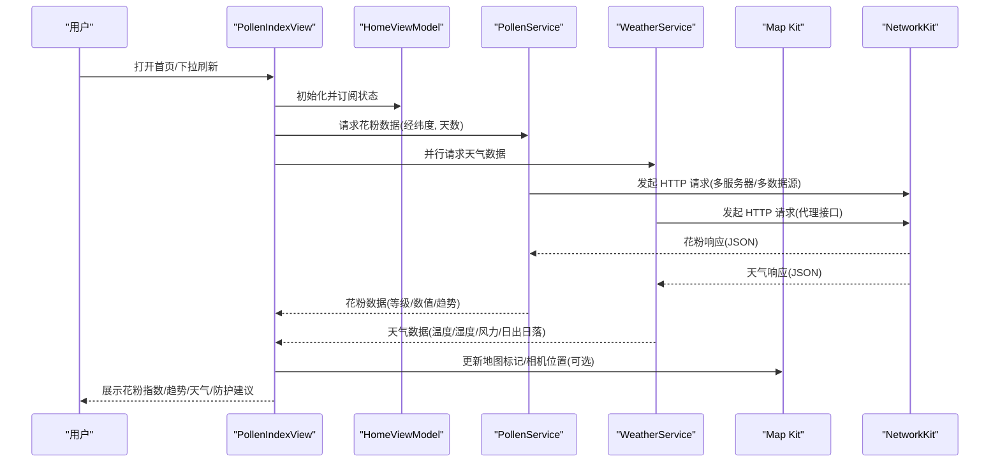
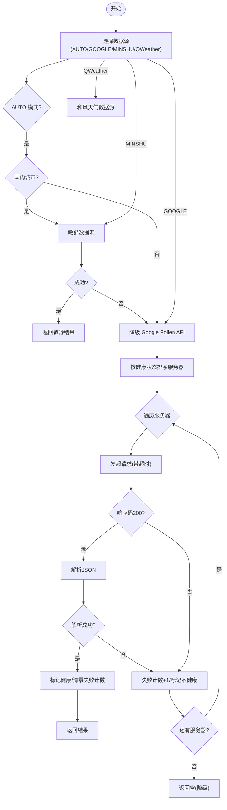
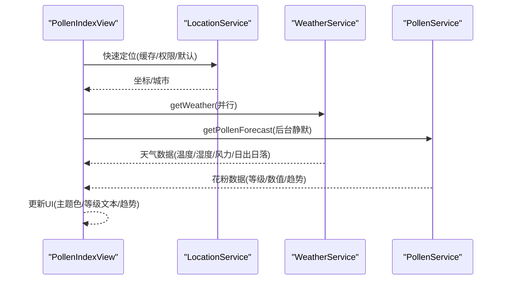
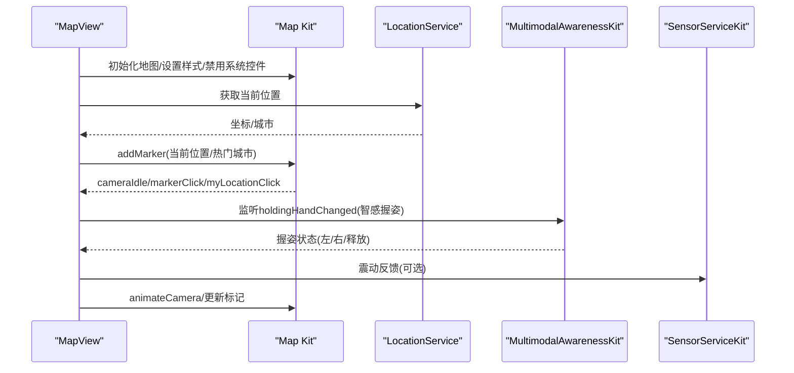
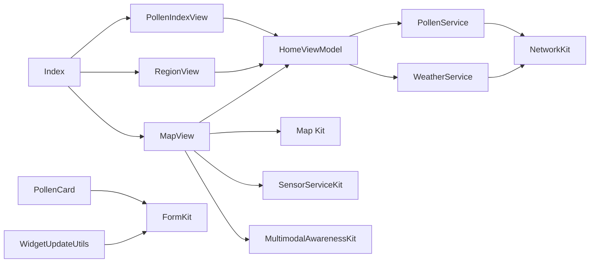

# 项目概述

<cite>
**本文引用的文件**
- [entry/src/main/module.json5](file://entry/src/main/module.json5)
- [AppScope/app.json5](file://AppScope/app.json5)
- [entry/src/main/resources/base/profile/main_pages.json](file://entry/src/main/resources/base/profile/main_pages.json)
- [entry/src/main/resources/base/element/string.json](file://entry/src/main/resources/base/element/string.json)
- [entry/build-profile.json5](file://entry/build-profile.json5)
- [entry/src/main/ets/model/PollenModel.ets](file://entry/src/main/ets/model/PollenModel.ets)
- [entry/src/main/ets/service/PollenService.ets](file://entry/src/main/ets/service/PollenService.ets)
- [entry/src/main/ets/viewmodel/HomeViewModel.ets](file://entry/src/main/ets/viewmodel/HomeViewModel.ets)
- [entry/src/main/ets/pages/Index.ets](file://entry/src/main/ets/pages/Index.ets)
- [entry/src/main/ets/views/MapView.ets](file://entry/src/main/ets/views/MapView.ets)
- [entry/src/main/ets/service/WeatherService.ets](file://entry/src/main/ets/service/WeatherService.ets)
- [entry/src/main/ets/utils/WidgetUpdateUtils.ets](file://entry/src/main/ets/utils/WidgetUpdateUtils.ets)
- [entry/src/main/ets/widget/PollenCard.ets](file://entry/src/main/ets/widget/PollenCard.ets)
- [entry/src/main/ets/views/PollenIndexView.ets](file://entry/src/main/ets/views/PollenIndexView.ets)
- [entry/src/main/ets/views/RegionView.ets](file://entry/src/main/ets/views/RegionView.ets)
</cite>

## 目录
1. [简介](#简介)
2. [项目结构](#项目结构)
3. [核心组件](#核心组件)
4. [架构总览](#架构总览)
5. [详细组件分析](#详细组件分析)
6. [依赖分析](#依赖分析)
7. [性能考量](#性能考量)
8. [故障排查指南](#故障排查指南)
9. [结论](#结论)
10. [附录](#附录)

## 简介
PollenForecast 是一款面向 HarmonyOS 的花粉浓度预报应用，旨在帮助用户了解当前及未来几天的花粉浓度、天气信息与防护建议，从而科学安排户外活动、降低花粉过敏风险。应用围绕“数据驱动 + 体验优化”的理念设计，采用 ArkTS 与 HarmonyOS 原生能力实现，结合 Map Kit 地图能力、多数据源聚合与本地化服务，提供稳定、直观、可交互的使用体验。

应用的核心价值主张：
- 实时与短期预报：提供当日与未来数日的花粉浓度预测，辅助用户制定出行计划。
- 天气联动：整合温度、湿度、风力、日出日落等天气要素，解释花粉扩散条件。
- 防护建议：基于花粉等级给出可执行的防护动作，降低过敏风险。
- 地图可视化：通过地图标记与交互，直观展示热点城市花粉状况与一键切换。
- 多数据源与容错：支持多数据源与故障转移，保证服务稳定性与可用性。
- 可视化卡片：提供桌面小组件，快速查看当前花粉浓度与风险等级。

## 项目结构
项目采用模块化的目录组织，核心入口与页面、服务、模型、工具、视图模型、扩展能力（表单/小组件）等分层清晰，便于维护与扩展。

- 应用元信息与权限
  - 应用包名、版本、图标、标签等在 AppScope/app.json5 中定义。
  - 模块权限与页面清单在 entry/src/main/module.json5 中声明。
  - 页面路由与主入口在 entry/src/main/resources/base/profile/main_pages.json 中配置。
  - 字符串资源与权限说明在 entry/src/main/resources/base/element/string.json 中集中管理。
  - 构建配置在 entry/build-profile.json5 中定义。

- 页面与导航
  - 入口页面 Index.ets 提供底部 Tab 导航，包含“花粉指数”“区域”“地图”“设置”四个页面。
  - 各页面组件分别位于 views 目录下，职责明确：PollenIndexView（首页）、RegionView（区域/城市）、MapView（地图）、SettingsView（设置）。

- 业务服务与数据模型
  - PollenService（花粉数据服务）负责多数据源聚合与故障转移。
  - WeatherService（天气服务）通过代理接口获取实时天气与天文数据。
  - PollenModel（数据模型）定义花粉等级、类型、防护建议等数据结构。
  - HomeViewModel（视图模型）管理首页状态与业务逻辑。

- 扩展能力
  - 表单/小组件：PollenCard（桌面卡片）与 WidgetUpdateUtils（卡片更新工具）实现数据绑定与批量更新。

图表来源
- [entry/src/main/ets/pages/Index.ets](file://entry/src/main/ets/pages/Index.ets#L1-L97)
- [entry/src/main/ets/views/PollenIndexView.ets](file://entry/src/main/ets/views/PollenIndexView.ets#L1-L120)
- [entry/src/main/ets/views/RegionView.ets](file://entry/src/main/ets/views/RegionView.ets#L1-L120)
- [entry/src/main/ets/views/MapView.ets](file://entry/src/main/ets/views/MapView.ets#L1-L120)
- [entry/src/main/ets/service/PollenService.ets](file://entry/src/main/ets/service/PollenService.ets#L1-L120)
- [entry/src/main/ets/service/WeatherService.ets](file://entry/src/main/ets/service/WeatherService.ets#L1-L120)
- [entry/src/main/ets/model/PollenModel.ets](file://entry/src/main/ets/model/PollenModel.ets#L1-L160)
- [entry/src/main/ets/widget/PollenCard.ets](file://entry/src/main/ets/widget/PollenCard.ets#L1-L76)
- [entry/src/main/ets/utils/WidgetUpdateUtils.ets](file://entry/src/main/ets/utils/WidgetUpdateUtils.ets#L1-L53)

章节来源
- [entry/src/main/module.json5](file://entry/src/main/module.json5#L1-L122)
- [AppScope/app.json5](file://AppScope/app.json5#L1-L11)
- [entry/src/main/resources/base/profile/main_pages.json](file://entry/src/main/resources/base/profile/main_pages.json#L1-L8)
- [entry/src/main/resources/base/element/string.json](file://entry/src/main/resources/base/element/string.json#L1-L60)
- [entry/build-profile.json5](file://entry/build-profile.json5#L1-L33)

## 核心组件
- 数据模型与等级映射
  - PollenModel 定义花粉等级（1-5）、类型（树木/草类/杂草）、防护建议、颜色与文本映射等，统一前端展示与主题色策略。
- 花粉数据服务
  - PollenService 支持多服务器故障转移、多数据源选择（AUTO/GOOGLE/MINSHU/CMA/QWeather），并提供健康检查与降级策略，增强稳定性。
- 天气服务
  - WeatherService 通过代理接口获取实时天气、日出日落与短期预报，并进行类型校验与字段提取。
- 首页视图模型
  - HomeViewModel 管理首页状态（加载/数据/错误/更新时间），并提供随机模拟数据与防护建议映射，便于开发与演示。
- 页面与导航
  - Index 提供底部 Tab 导航；各页面通过 @StorageLink 共享状态，实现跨页面数据一致性。
- 地图与交互
  - MapView 集成 Map Kit，支持相机移动、标记点击、夜间模式、智感握姿（API 20+）与震动反馈，优化单手操作体验。
- 桌面小组件
  - PollenCard 与 WidgetUpdateUtils 提供卡片渲染与批量更新，实现桌面快捷查看。

章节来源
- [entry/src/main/ets/model/PollenModel.ets](file://entry/src/main/ets/model/PollenModel.ets#L1-L160)
- [entry/src/main/ets/service/PollenService.ets](file://entry/src/main/ets/service/PollenService.ets#L1-L200)
- [entry/src/main/ets/service/WeatherService.ets](file://entry/src/main/ets/service/WeatherService.ets#L1-L120)
- [entry/src/main/ets/viewmodel/HomeViewModel.ets](file://entry/src/main/ets/viewmodel/HomeViewModel.ets#L1-L120)
- [entry/src/main/ets/pages/Index.ets](file://entry/src/main/ets/pages/Index.ets#L1-L97)
- [entry/src/main/ets/views/MapView.ets](file://entry/src/main/ets/views/MapView.ets#L1-L120)
- [entry/src/main/ets/widget/PollenCard.ets](file://entry/src/main/ets/widget/PollenCard.ets#L1-L76)
- [entry/src/main/ets/utils/WidgetUpdateUtils.ets](file://entry/src/main/ets/utils/WidgetUpdateUtils.ets#L1-L53)

## 架构总览
应用采用“页面-视图模型-服务-模型-原生能力”的分层架构，页面通过视图模型协调服务与模型，服务通过原生能力（网络、地图、传感器等）获取数据并回填状态，最终驱动 UI 呈现。

图表来源
- [entry/src/main/ets/views/PollenIndexView.ets](file://entry/src/main/ets/views/PollenIndexView.ets#L180-L360)
- [entry/src/main/ets/service/PollenService.ets](file://entry/src/main/ets/service/PollenService.ets#L230-L320)
- [entry/src/main/ets/service/WeatherService.ets](file://entry/src/main/ets/service/WeatherService.ets#L90-L170)
- [entry/src/main/ets/views/MapView.ets](file://entry/src/main/ets/views/MapView.ets#L410-L520)

## 详细组件分析

### 数据模型与等级映射（PollenModel）
- 职责：定义花粉等级、类型、防护建议、颜色与文本映射，统一 UI 展示策略。
- 关键点：
  - 等级枚举与中文描述、颜色与背景色映射、表情图标映射。
  - 防护建议结构化，按等级提供标题、描述与行动清单。
- 复杂度：常量时间查询，O(1) 映射。
- 优化：集中映射减少分支判断，利于主题色与无障碍文案。

章节来源
- [entry/src/main/ets/model/PollenModel.ets](file://entry/src/main/ets/model/PollenModel.ets#L1-L160)

### 花粉数据服务（PollenService）
- 职责：聚合多数据源，实现故障转移与降级策略，提供稳定的数据获取。
- 关键点：
  - 多服务器配置与健康检查（失败计数、重试窗口、最近成功时间）。
  - 数据源选择：AUTO 模式下国内优先敏舒，失败则降级 Google；也可直接选择 MINSHU/QWeather。
  - 请求超时与异常处理，JSON 解析失败回退。
- 复杂度：排序与状态查询 O(n)，请求为 IO 密集。
- 优化：服务器优先级排序、健康检查缓存、失败阈值与重试窗口。

图表来源
- [entry/src/main/ets/service/PollenService.ets](file://entry/src/main/ets/service/PollenService.ets#L1-L200)
- [entry/src/main/ets/service/PollenService.ets](file://entry/src/main/ets/service/PollenService.ets#L230-L438)

章节来源
- [entry/src/main/ets/service/PollenService.ets](file://entry/src/main/ets/service/PollenService.ets#L1-L438)

### 天气服务（WeatherService）
- 职责：通过代理接口获取实时天气、日出日落与短期预报，整合为统一结构。
- 关键点：
  - 并行请求实时天气、天文与短期预报，类型校验与字段提取。
  - 时间解析与默认值处理，保证 UI 稳定性。
- 复杂度：IO 密集，解析 O(n)。
- 优化：并行请求、超时控制、错误降级。

章节来源
- [entry/src/main/ets/service/WeatherService.ets](file://entry/src/main/ets/service/WeatherService.ets#L1-L232)

### 首页视图模型（HomeViewModel）
- 职责：管理首页状态、提供模拟数据与防护建议映射。
- 关键点：
  - 状态结构化（加载/数据/错误/更新时间），工具方法生成随机数据与天气描述。
- 复杂度：常量时间状态更新与映射。
- 优化：开发阶段模拟数据提升体验，生产环境由服务注入真实数据。

章节来源
- [entry/src/main/ets/viewmodel/HomeViewModel.ets](file://entry/src/main/ets/viewmodel/HomeViewModel.ets#L1-L218)

### 首页页面（PollenIndexView）
- 职责：聚合花粉与天气数据，展示环形图、趋势、防护建议与天气卡片。
- 关键点：
  - 快速定位与缓存优先策略，后台静默刷新花粉数据，避免阻塞 UI。
  - 数据源变化与城市变化监听，自动重新加载。
  - 非花粉季提示与无障碍文案。
- 复杂度：渲染与布局为主，数据 IO 由服务层承担。
- 优化：并行请求、节流与可见性动画，提升感知性能。

图表来源
- [entry/src/main/ets/views/PollenIndexView.ets](file://entry/src/main/ets/views/PollenIndexView.ets#L90-L220)
- [entry/src/main/ets/views/PollenIndexView.ets](file://entry/src/main/ets/views/PollenIndexView.ets#L190-L360)

章节来源
- [entry/src/main/ets/views/PollenIndexView.ets](file://entry/src/main/ets/views/PollenIndexView.ets#L1-L420)

### 区域页面（RegionView）
- 职责：城市列表、搜索、收藏、置顶与距离计算；批量获取花粉数据并缓存。
- 关键点：
  - 搜索模式区分数据源（Google 限制基础城市，国内源支持全国 3200+ 区域）。
  - 分组显示（按省/按首字母），支持展开/折叠与右侧索引。
  - 批量请求与节流，避免请求风暴。
- 复杂度：排序与分组 O(n log n)，批量请求 O(n)。
- 优化：分批并发、缓存与节流，提升交互流畅度。

章节来源
- [entry/src/main/ets/views/RegionView.ets](file://entry/src/main/ets/views/RegionView.ets#L1-L260)
- [entry/src/main/ets/views/RegionView.ets](file://entry/src/main/ets/views/RegionView.ets#L380-L460)

### 地图页面（MapView）
- 职责：集成 Map Kit，展示当前位置与热门城市标记，支持相机移动、夜间模式、智感握姿与震动反馈。
- 关键点：
  - 事件兼容：API 17-19 使用 controller.on，API 20+ 使用 MapEventManager。
  - 相机空闲监听控制标记可见性，避免重叠。
  - 智感握姿（API 20+）：检测左右手握持，自动调整悬浮按钮位置与震动反馈。
- 复杂度：事件监听与动画为主，IO 由服务层承担。
- 优化：事件解耦、动画时长与防抖、夜间模式切换。

图表来源
- [entry/src/main/ets/views/MapView.ets](file://entry/src/main/ets/views/MapView.ets#L320-L420)
- [entry/src/main/ets/views/MapView.ets](file://entry/src/main/ets/views/MapView.ets#L420-L520)
- [entry/src/main/ets/views/MapView.ets](file://entry/src/main/ets/views/MapView.ets#L520-L620)

章节来源
- [entry/src/main/ets/views/MapView.ets](file://entry/src/main/ets/views/MapView.ets#L1-L200)
- [entry/src/main/ets/views/MapView.ets](file://entry/src/main/ets/views/MapView.ets#L200-L400)

### 桌面小组件（PollenCard 与 WidgetUpdateUtils）
- 职责：渲染卡片、绑定数据、批量更新。
- 关键点：
  - 通过 Preferences 存储 formIds，遍历更新卡片。
  - 点击卡片跳转应用首页。
- 复杂度：批量更新 O(n)。
- 优化：错误处理与日志记录，避免卡片失效导致的全局失败。

章节来源
- [entry/src/main/ets/widget/PollenCard.ets](file://entry/src/main/ets/widget/PollenCard.ets#L1-L76)
- [entry/src/main/ets/utils/WidgetUpdateUtils.ets](file://entry/src/main/ets/utils/WidgetUpdateUtils.ets#L1-L53)

## 依赖分析
- 组件耦合与内聚
  - 页面与视图模型：松耦合，通过状态共享与事件回调交互。
  - 视图模型与服务：弱耦合，通过接口抽象与错误处理隔离。
  - 服务与原生能力：通过 NetworkKit、Map Kit、FormKit 等接口解耦。
- 外部依赖与集成点
  - 网络：NetworkKit 提供 HTTP 请求能力。
  - 地图：Map Kit 提供地图渲染、事件与相机控制。
  - 传感器：SensorServiceKit 提供震动反馈。
  - 多模态：MultimodalAwarenessKit 提供智感握姿。
  - 表单/小组件：FormKit 提供卡片生命周期与更新。
- 潜在循环依赖
  - 未发现直接循环依赖；页面与服务通过接口与状态共享间接交互。

图表来源
- [entry/src/main/ets/pages/Index.ets](file://entry/src/main/ets/pages/Index.ets#L1-L97)
- [entry/src/main/ets/views/PollenIndexView.ets](file://entry/src/main/ets/views/PollenIndexView.ets#L1-L120)
- [entry/src/main/ets/views/RegionView.ets](file://entry/src/main/ets/views/RegionView.ets#L1-L120)
- [entry/src/main/ets/views/MapView.ets](file://entry/src/main/ets/views/MapView.ets#L1-L120)
- [entry/src/main/ets/service/PollenService.ets](file://entry/src/main/ets/service/PollenService.ets#L1-L120)
- [entry/src/main/ets/service/WeatherService.ets](file://entry/src/main/ets/service/WeatherService.ets#L1-L120)
- [entry/src/main/ets/widget/PollenCard.ets](file://entry/src/main/ets/widget/PollenCard.ets#L1-L76)
- [entry/src/main/ets/utils/WidgetUpdateUtils.ets](file://entry/src/main/ets/utils/WidgetUpdateUtils.ets#L1-L53)

章节来源
- [entry/src/main/ets/pages/Index.ets](file://entry/src/main/ets/pages/Index.ets#L1-L97)
- [entry/src/main/ets/views/PollenIndexView.ets](file://entry/src/main/ets/views/PollenIndexView.ets#L1-L120)
- [entry/src/main/ets/views/RegionView.ets](file://entry/src/main/ets/views/RegionView.ets#L1-L120)
- [entry/src/main/ets/views/MapView.ets](file://entry/src/main/ets/views/MapView.ets#L1-L120)
- [entry/src/main/ets/service/PollenService.ets](file://entry/src/main/ets/service/PollenService.ets#L1-L120)
- [entry/src/main/ets/service/WeatherService.ets](file://entry/src/main/ets/service/WeatherService.ets#L1-L120)
- [entry/src/main/ets/widget/PollenCard.ets](file://entry/src/main/ets/widget/PollenCard.ets#L1-L76)
- [entry/src/main/ets/utils/WidgetUpdateUtils.ets](file://entry/src/main/ets/utils/WidgetUpdateUtils.ets#L1-L53)

## 性能考量
- 并行与静默刷新
  - 首页并行请求天气与花粉数据，天气完成后立即结束刷新动画，提升感知性能。
  - 花粉数据静默刷新，避免阻塞用户操作。
- 事件与动画
  - 地图相机空闲监听控制标记可见性，避免重叠与过度绘制。
  - 智感握姿采用防抖与动画时长控制，平衡响应与能耗。
- 数据源与缓存
  - PollenService 的健康检查与失败阈值减少无效请求。
  - RegionView 批量请求与节流，避免请求风暴。
- 资源与主题
  - 集中颜色与文本映射，减少分支判断与重复计算。
  - 夜间模式切换通过 Map Kit 内置方法实现，避免额外重绘。

## 故障排查指南
- 网络与数据源
  - 若花粉数据为空，检查 PollenService 的服务器健康状态与降级路径；确认数据源选择与地区判断逻辑。
  - 若天气数据异常，检查代理接口返回码与 JSON 结构，关注类型校验与默认值处理。
- 地图与权限
  - Map Kit 初始化失败时，检查 MapEventManager 兼容性与 API 版本；确认系统控件禁用与相机移动参数。
  - 智感握姿未生效时，检查 API 版本与开关状态，以及页面前后台状态。
- 小组件更新
  - 小组件未更新时，检查 formIds 存储与错误日志，必要时清理失效 ID 并重试更新。
- 定位与权限
  - 无定位权限或定位失败时，检查权限申请流程与默认位置回退逻辑。

章节来源
- [entry/src/main/ets/service/PollenService.ets](file://entry/src/main/ets/service/PollenService.ets#L380-L438)
- [entry/src/main/ets/service/WeatherService.ets](file://entry/src/main/ets/service/WeatherService.ets#L120-L232)
- [entry/src/main/ets/views/MapView.ets](file://entry/src/main/ets/views/MapView.ets#L320-L420)
- [entry/src/main/ets/utils/WidgetUpdateUtils.ets](file://entry/src/main/ets/utils/WidgetUpdateUtils.ets#L1-L53)

## 结论
PollenForecast 通过清晰的模块化架构与 HarmonyOS 原生能力，实现了稳定、直观、可交互的花粉浓度预报体验。其多数据源聚合与故障转移机制提升了可用性，地图与智感握姿等交互增强了可用性，桌面小组件提供了便捷入口。项目在性能与用户体验之间取得良好平衡，具备良好的扩展性与维护性。

## 附录
- 技术栈概览
  - 语言与框架：ArkTS、HarmonyOS Stage 模式
  - 网络：NetworkKit
  - 地图：Map Kit
  - 传感器：SensorServiceKit
  - 多模态：MultimodalAwarenessKit
  - 表单/小组件：FormKit
  - 构建：hvigor、build-profile.json5
- 主要使用场景
  - 日常查看花粉浓度与天气，制定户外活动计划。
  - 通过地图快速切换城市，查看热点区域花粉状况。
  - 使用桌面小组件快速了解当前风险等级。
- 目标用户群体
  - 花粉过敏人群、关注空气质量的用户、需要短期天气与花粉信息的通勤族与户外爱好者。
- 核心价值主张
  - 精准、及时、可执行的花粉与天气信息，辅以防护建议与可视化交互，降低过敏风险，提升生活质量。