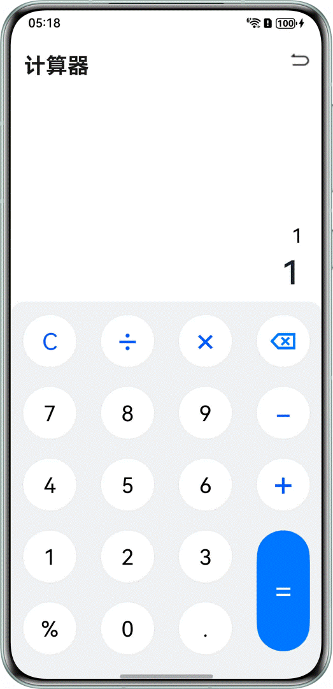

# 计算器

## 介绍
计算器是实用工具类应用中的典型场景之一。  
本示例实现了计算器的计算功能，包括加减乘除四个基本运算，小数计算、百分数计算以及清除结果功能，通过[@Watch](https://developer.huawei.com/consumer/cn/doc/harmonyos-guides/arkts-watch)装饰器对计算结果进行监听。

## 效果预览图


## 约束与限制
- 本示例支持API Version 20 Release及以上版本。
- 本示例支持HarmonyOS 6.0.0 Release SDK及以上版本。
- 本示例需要使用DevEco Studio 6.0.0 Release及以上版本进行编译运行。

## 权限说明
无

## 实现思路
- 通过[@Watch](https://developer.huawei.com/consumer/cn/doc/harmonyos-guides/arkts-watch)装饰器对计算结果进行监听。
```
@State @Watch('inputValueChange') inputValue: string = '';
```
- 删除数据：首先，先获取输入框内的字符长度，将字符转换为数组。然后，通过[slice](https://developer.huawei.com/consumer/cn/doc/harmonyos-references/arkts-apis-arkts-collections-arraybuffer#slice)方法截取数组，每点击一次删除按钮，数组长度减一，同时结果框中显示的数据减少一位，从而实现逐位删除数据的效果。
```
inputDelete(len: number) {
  if (len === 0) {
    return;
  }
  ...
  }
}
```
- 加、减法运算逻辑：首先判断操作符和数字是否包含科学记号，然后根据操作符进行加减操作。如果操作数包含小数点，算法会通过扩大倍数来保证小数点对齐，再进行加减运算，并通过[toFixed](https://developer.huawei.com/consumer/cn/doc/harmonyos-references/js-apis-arkts-decimal#tofixed)方法保留相应的位数，如此便可正确处理任意精度的加减法。
```
add(arg1: string, arg2: string, symbol: string): number {
  let addFlag = (symbol === CommonConstants.ADD);
  if (this.containScientificNotation(arg1) || this.containScientificNotation(arg2)) {
    ...
  }
  ...
}
```
- 乘、除法运算逻辑：首先判断运算符号和数字是否含科学计数法，然后根据符号进行乘除运算，处理小数点和科学计数法，确保计算的准确性。
```
mulOrDiv(arg1: string, arg2: string, symbol: string): number {
  let mulFlag = (symbol === CommonConstants.MUL);
  ...
}
```
## 工程结构
```
├──entry/src/main/ets            // 代码区
│  ├──common 
│  │  ├──constants    
│  │  │  └──CommonConstants.ets  // 常量文件
│  │  └──util
│  │     ├──CalculateUtil.ets    // 计算器工具类
│  │     ├──CheckEmptyUtil.ets   // 检查空工具
│  │     └──Logger.ets           // 日志工具 
│  ├──entryability 
│  │  └──EntryAbility.ets        
│  ├──entrybackupability 
│  │  └──EntryBackupAbility.ets  
│  ├──pages
│  │  └──HomePage.ets            // 主页面    
│  └──viewmodel
│     ├──PressKeysItem.ets       // 按钮个例对象
│     └──PresskeysViewModel.ets  // 按钮数据集     
└──entry/src/main/resources      // 应用资源目录
```
## 模块依赖
无

## 参考资料
[@Watch装饰器](https://developer.huawei.com/consumer/cn/doc/harmonyos-guides/arkts-watch)  
[Class (ArrayBuffer)](https://developer.huawei.com/consumer/cn/doc/harmonyos-references/arkts-apis-arkts-collections-arraybuffer)
[@arkts.math.Decimal(高精度数学库Decimal)](https://developer.huawei.com/consumer/cn/doc/harmonyos-references/js-apis-arkts-decimal)

## ChangeLog
| 修改内容  | 时间         |
|-------|------------|
| demo优化 | 2025.05.28 |